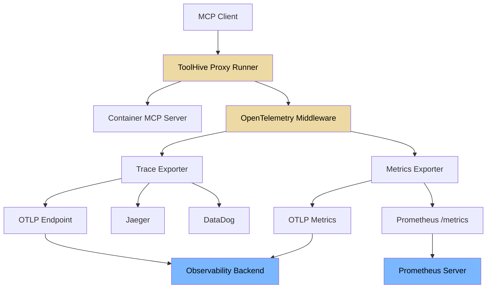
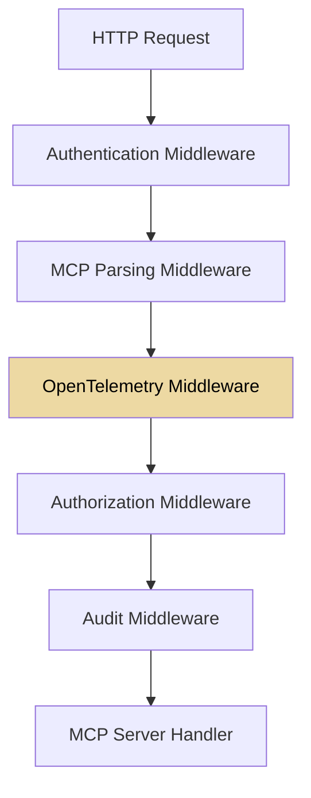

# Observability and Telemetry

This document describes the observability architecture implemented in ToolHive
for monitoring MCP (Model Context Protocol) server interactions. ToolHive
provides OpenTelemetry-based instrumentation with support for distributed
tracing, metrics collection, and structured logging.

This document is intended for developers working on ToolHive. For user guides on
setting up and using these features, see the ToolHive documentation:

- [Observability overview](https://docs.stacklok.com/toolhive/concepts/observability),
  including trace structure and example metrics
- [CLI guide](https://docs.stacklok.com/toolhive/guides-cli/telemetry-and-metrics),
  including how to enable and configure telemetry and send to common backends

To run a complete local observability stack (Prometheus, Grafana, and the
OpenTelemetry Collector) for testing this instrumentation, see the
[OpenTelemetry example stack](../examples/otel/README.md).

For migrating from legacy attribute names to the new OTEL MCP semantic
conventions, see the [Telemetry Migration Guide](./telemetry-migration-guide.md).

## Overview

ToolHive's observability stack provides complete visibility into MCP proxy
operations through:

1. **Distributed tracing**: Track requests across the proxy-container boundary
   with OpenTelemetry traces
2. **Metrics collection**: Monitor performance, usage patterns, and error rates
   with Prometheus and OTLP metrics
3. **Structured logging**: Capture detailed audit events for compliance and
   debugging
4. **Protocol-aware instrumentation**: MCP-specific insights beyond generic HTTP
   metrics

See [the original design document](https://github.com/stacklok/toolhive-rfcs/blob/main/rfcs/THV-0001-otel-integration-proposal.md) for
more details on the design and goals of this observability architecture.

## Architecture



## Integration with Existing Middleware

The OpenTelemetry middleware integrates seamlessly with ToolHive's
[existing middleware stack](./middleware.md):



The telemetry middleware:

- **Leverages parsed MCP data** from the parsing middleware
- **Includes authentication context** from JWT claims
- **Captures authorization decisions** for compliance
- **Correlates with audit events** for complete observability

This provides end-to-end visibility across the entire request lifecycle while
maintaining the modular architecture of ToolHive's middleware system.

## Configuration

### CLI Flags

| Flag | Type | Default | Description |
|------|------|---------|-------------|
| `--otel-endpoint` | string | `""` | OTLP endpoint URL (e.g., `localhost:4317`). Telemetry is disabled when empty and Prometheus is not enabled. |
| `--otel-tracing-enabled` | bool | `true` | Enable distributed tracing (requires endpoint) |
| `--otel-metrics-enabled` | bool | `true` | Enable OTLP metrics export (requires endpoint) |
| `--otel-sampling-rate` | float | `0.1` | Trace sampling rate (0.0–1.0). The CLI default is `0.1` (10%); the Kubernetes CRD default is `0.05` (5%). Config file values override the CLI default when the flag is not explicitly set. |
| `--otel-service-name` | string | `"toolhive-mcp-proxy"` | Service name for telemetry resource |
| `--otel-headers` | string[] | `nil` | OTLP authentication headers (`key=value` format) |
| `--otel-insecure` | bool | `false` | Use HTTP instead of HTTPS for the OTLP endpoint |
| `--otel-enable-prometheus-metrics-path` | bool | `false` | Expose Prometheus `/metrics` endpoint on a dedicated diagnostics port (see [Metrics endpoint exposure](#metrics-endpoint-exposure)) |
| `--otel-env-vars` | string[] | `nil` | Environment variables to include in spans (comma-separated) |
| `--otel-custom-attributes` | string | `""` | Custom resource attributes (`key1=value1,key2=value2`) |
| `--otel-use-legacy-attributes` | bool | `true` | Emit legacy attribute names alongside new OTEL semantic convention names |

### Configuration File

Telemetry can also be configured via `~/.toolhive/config.yaml`:

```yaml
otel:
  endpoint: "localhost:4317"
  sampling-rate: 0.1
  env-vars:
    - NODE_ENV
    - DEPLOYMENT_ENV
  insecure: true
  use-legacy-attributes: false
```

CLI flags take precedence over configuration file values when explicitly set.

### Kubernetes CRD

**MCPTelemetryConfig (preferred)**: Define telemetry settings in a shared
`MCPTelemetryConfig` resource and reference it via `spec.telemetryConfigRef`
in MCPServer, MCPRemoteProxy, or VirtualMCPServer. This eliminates duplication
when managing multiple servers. Each server provides a unique `serviceName`
override. Sensitive headers (API keys, bearer tokens) are stored in Kubernetes
Secrets via `sensitiveHeaders[].secretKeyRef`.

```yaml
apiVersion: toolhive.stacklok.dev/v1beta1
kind: MCPTelemetryConfig
metadata:
  name: shared-otel
spec:
  openTelemetry:
    enabled: true
    endpoint: otel-collector:4318
    insecure: true
    tracing:
      enabled: true
      samplingRate: "0.1"
    metrics:
      enabled: true
---
apiVersion: toolhive.stacklok.dev/v1beta1
kind: MCPServer
metadata:
  name: my-server
spec:
  # ... other fields ...
  telemetryConfigRef:
    name: shared-otel
    serviceName: my-server    # unique per server
```

See [`examples/operator/mcp-servers/mcpserver_fetch_otel.yaml`](../examples/operator/mcp-servers/mcpserver_fetch_otel.yaml)
for a complete example.

**Inline (deprecated)**: The inline `spec.telemetry` (MCPServer, MCPRemoteProxy)
and `spec.config.telemetry` (VirtualMCPServer) fields still work but are
deprecated and will be removed in a future API version. They are mutually exclusive with
`telemetryConfigRef` (CEL enforced). All three resource types now support
`spec.telemetryConfigRef`.

For VirtualMCPServer telemetry, see the
[vMCP observability docs](./operator/virtualmcpserver-observability.md).

### Validation Rules

- If an OTLP endpoint is configured but both `tracingEnabled` and
  `metricsEnabled` are `false`, configuration validation fails.
- If only `enablePrometheusMetricsPath` is enabled (no OTLP endpoint),
  Prometheus metrics are served without OTLP export.
- If nothing is configured (no endpoint, no Prometheus), telemetry is disabled.

### Metrics endpoint exposure

When `enablePrometheusMetricsPath` is on, `/metrics` is served on a **dedicated
diagnostics listener**, not on the transport port that serves MCP traffic.

This is deliberate, and it is worth being precise about what it does and does not
give you.

**The endpoint is unauthenticated either way.** The diagnostics listener carries no
middleware — no authentication, rate limiting, body limits, or audit. Moving
`/metrics` off the transport port does not add any of those.

**What it gives you is control by port.** Kubernetes `NetworkPolicy` matches on
pods, ports, and protocols — it cannot filter on HTTP path. So while `/metrics`
shares the transport port, there is no way to express "allow MCP traffic, deny
metrics scraping": any policy that permits your MCP clients also permits scraping.
On its own port, that becomes expressible. Route-level controls (Gateway API,
Ingress path rules) can hide the path from external traffic, but they only govern
what passes through the gateway and leave pod-to-pod traffic untouched.

It also means the safe outcome does not depend on every deployment getting its
route rules right. The ToolHive operator already binds its own metrics endpoint
this way (`--metrics-bind-address`), as do etcd (`--listen-metrics-urls`) and
controller-runtime.

(Serving `/metrics` on the transport mux is also what put it outside the middleware
chain: Go's `ServeMux` resolves the most specific registered pattern first, so an
explicit `/metrics` always outranks the `/` catch-all that carries the chain.)

#### Migration window

`/metrics` is currently served on **both** the transport port and the diagnostics
port. That is deliberate and temporary, so no existing scrape configuration breaks
while it is moved:

1. Point your scraper at the diagnostics port and confirm metrics arrive.
2. Set `metricsOnTransportPort: false` to stop serving the old location, and confirm
   nothing else was still scraping it.
3. When the window closes the default flips, and only the diagnostics port serves
   `/metrics`. See [issue #6384](https://github.com/stacklok/toolhive/issues/6384) for
   the timeline.

A deployment that sets `metricsOnTransportPort` explicitly is not moved by the flip.
Leaving it unset is what opts you into the new default when it changes — the value is
resolved at startup rather than written into stored configuration, so existing
workloads pick up the new default without being recreated.

While the transport-port copy is being served, a warning is logged at startup naming
the transport port. That endpoint is on the listener that carries MCP traffic, so it
cannot be restricted separately — which is the reason for the move.

Port selection:

- **Default** — port `9464`, the OpenTelemetry specification's Prometheus exporter
  default (`OTEL_EXPORTER_PROMETHEUS_PORT`), so scrapers already expect it there.
- **Explicit** — set `prometheusPort` to override it.
- **Fallback** — if the requested port is already bound (several CLI workloads on
  one machine, for example) an available port is chosen instead. The resolved
  address is logged at startup.

#### Finding the endpoint after an upgrade

If metrics stopped arriving after an upgrade, the endpoint moved off the transport
port. Two things tell you where it went:

- **The startup log.** A warning naming the resolved address is emitted whenever
  metrics are enabled: `prometheus metrics are served on a dedicated diagnostics
  port, not the application port`.
- **The old address.** `GET /metrics` on the transport port returns 404 with a body
  explaining that metrics moved and telling you which log line carries the address.
  It names no port: the listener honours a configured port and falls back to another
  when that one is taken, so only the log is reliably correct.

Prometheus reports the stale target as `up == 0` with a 404, so an alert on scrape
failure fires — but neither the alert nor a bare 404 says *why*, which is what these
two signals add.

#### Restricting access to the diagnostics port

Leave the diagnostics port out of any Service or Ingress that faces the internet,
and restrict which pods may reach it. Since the endpoint is unauthenticated, this
policy is what protects it:

```yaml
apiVersion: networking.k8s.io/v1
kind: NetworkPolicy
metadata:
  name: mcpserver-diagnostics
spec:
  podSelector:
    matchLabels:
      app.kubernetes.io/name: mcpserver
      app.kubernetes.io/instance: my-mcp-server
  policyTypes: [Ingress]
  ingress:
    # Only the monitoring namespace may scrape the diagnostics port.
    - from:
        - namespaceSelector:
            matchLabels:
              kubernetes.io/metadata.name: monitoring
      ports:
        - protocol: TCP
          port: 9464
```

This is the rule that cannot be written while `/metrics` shares the transport port,
because it would also have to permit MCP traffic.

#### Scope external routes to the paths you need

A `NetworkPolicy` governs which pods may connect. It says nothing about which paths
your gateway publishes. Those are separate controls and you want both.

The operator creates a plain `Service` — it does not create an `Ingress` or an
`HTTPRoute`, so the external route is yours to define. Route only the paths clients
actually need rather than sending `/` at the workload. A blanket `/` publishes
everything on the transport port, including endpoints meant to stay internal, and it
publishes anything added to that mux in future releases without you revisiting the
rule.

What lives on the transport port:

| Path | Publish externally? |
|------|---------------------|
| `/mcp` | Yes, for `streamable-http` — this is the MCP endpoint |
| `/sse` and `/messages` | Yes, for `sse` — the stream and the POST channel |
| `/.well-known/oauth-protected-resource` | Yes, if clients perform OAuth discovery (RFC 9728) |
| `/.well-known/openid-configuration`, `/.well-known/oauth-authorization-server`, `/.well-known/jwks.json`, `/oauth/` | Only when the embedded authorization server is enabled |
| `/health` | No — it exists for Kubernetes probes, which reach it in-cluster |
| `/metrics` | During the migration window, yes — see [Migration window](#migration-window). After it closes, no; it returns 404 on this listener |

For a transparent proxy fronting a remote MCP server, the MCP path is whatever the
backend exposes, since that proxy forwards `/` to the backend.

An `HTTPRoute` publishing only the streamable-http endpoint and OAuth discovery:

```yaml
apiVersion: gateway.networking.k8s.io/v1
kind: HTTPRoute
metadata:
  name: my-mcp-server
spec:
  parentRefs:
    - name: my-gateway
  hostnames:
    - my-mcp-server.example.com
  rules:
    - matches:
        - path:
            type: Exact
            value: /mcp
        - path:
            type: PathPrefix
            value: /.well-known/oauth-protected-resource
      backendRefs:
        - name: my-mcp-server
          port: 8080
```

The equivalent with an `Ingress` is a `path` entry per route with
`pathType: Exact` or `Prefix`; avoid a single `path: /` with `pathType: Prefix`.

Never add the diagnostics port to a `Service` or route that faces the internet. It is
not on the transport port, so a path-scoped route excludes it automatically — but
adding it back by hand undoes that.

`/health` deliberately stays on the transport port so Kubernetes liveness and
readiness probes keep working. It exposes no version or build information.

> **Cardinality warning.** Metric label values derived from client input (MCP
> method, tool, and prompt names) are bounded in length, and the OpenTelemetry SDK
> caps attribute sets at 2000 per instrument. Both readers aggregate cumulatively,
> so every distinct attribute set stays resident for the process lifetime. Avoid
> adding new client-controlled values as metric labels; put them on spans instead.

## Metrics Reference

### MCP Proxy Metrics

These metrics are emitted by the telemetry middleware (`pkg/telemetry/middleware.go`)
for each MCP server proxy.

#### `toolhive_mcp_requests` (Counter)

Total number of MCP requests processed.

| Attribute | Type | Description |
|-----------|------|-------------|
| `method` | string | HTTP method (`POST`, `GET`) |
| `status_code` | string | HTTP status code (`200`, `500`) |
| `status` | string | `"success"` or `"error"` (error if status >= 400) |
| `mcp_method` | string | MCP method name (`tools/call`, `resources/read`, etc.) |
| `mcp_resource_id` | string | Tool name, resource URI, or prompt name |
| `server` | string | MCP server name |
| `transport` | string | Backend transport type (`stdio`, `sse`, `streamable-http`) |

> **Note**: SSE connection establishment events also increment this counter
> with `mcp_method="sse_connection"` and do not include `mcp_resource_id`.

#### `toolhive_mcp_request_duration` (Histogram, seconds)

Duration of MCP requests. Uses default histogram bucket boundaries.

**Attributes**: Same as `toolhive_mcp_requests`.

#### `mcp.server.operation.duration` (Histogram, seconds)

Duration of MCP server operations per the
[OTEL MCP semantic conventions](https://github.com/open-telemetry/semantic-conventions/blob/main/docs/gen-ai/mcp.md).

**Bucket boundaries**: `[0.01, 0.02, 0.05, 0.1, 0.2, 0.5, 1, 2, 5, 10, 30, 60, 120, 300]`

| Attribute | Type | Condition | Description |
|-----------|------|-----------|-------------|
| `mcp.method.name` | string | Always | MCP method (`tools/call`, `resources/read`, etc.) |
| `jsonrpc.protocol.version` | string | Always | Always `"2.0"` |
| `network.transport` | string | Always | `"tcp"` or `"pipe"` |
| `network.protocol.name` | string | If applicable | `"http"` for SSE/streamable-http |
| `network.protocol.version` | string | If available | HTTP protocol version (`1.1`, `2`) |
| `error.type` | string | On HTTP 5xx | HTTP status code as string |
| `gen_ai.operation.name` | string | For `tools/call` | Always `"execute_tool"` |
| `gen_ai.tool.name` | string | For `tools/call` | Tool name |
| `gen_ai.prompt.name` | string | For `prompts/get` | Prompt name |

#### `toolhive_mcp_tool_calls` (Counter)

Total number of MCP tool invocations (only recorded for `tools/call` requests).

| Attribute | Type | Description |
|-----------|------|-------------|
| `server` | string | MCP server name |
| `tool` | string | Tool name |
| `status` | string | `"success"` or `"error"` |

#### `toolhive_mcp_active_connections` (UpDownCounter)

Number of currently active MCP connections.

| Attribute | Type | Description |
|-----------|------|-------------|
| `server` | string | MCP server name |
| `transport` | string | Backend transport type |
| `connection_type` | string | `"sse"` (only present for SSE connections) |

### Rate Limit Metrics

These metrics are emitted for Redis-backed rate limit checks used by MCPServer
and VirtualMCPServer. Prometheus appends `_total` to counter names. The latency
histogram is exported with the `_seconds` unit suffix and the standard
`_bucket`, `_sum`, and `_count` series suffixes.

#### `toolhive_rate_limit_decisions` (Counter)

Total number of rate limit bucket decisions. An allowed request increments once
for every applicable bucket. A rejected request increments only for the first
bucket rejected by the atomic Redis check. Requests with no applicable bucket
do not increment this counter.

| Attribute | Type | Description |
|-----------|------|-------------|
| `namespace` | string | Kubernetes namespace associated with the server |
| `server` | string | MCPServer or VirtualMCPServer name |
| `decision` | string | `"allowed"` or `"rejected"` |
| `scope` | string | `"shared"` or `"per_user"` |
| `operation_type` | string | `"server"` or `"tool"` |

#### `toolhive_rate_limit_redis_errors` (Counter)

Total number of Redis errors encountered while checking rate limits.

| Attribute | Type | Description |
|-----------|------|-------------|
| `namespace` | string | Kubernetes namespace associated with the server |
| `server` | string | MCPServer or VirtualMCPServer name |
| `error_type` | string | `"timeout"`, `"connection"`, `"auth"`, or `"other"` |

#### `toolhive_rate_limit_fail_open` (Counter)

Total number of rate limit checks allowed after an enforcement error. Prometheus
exports this counter as `toolhive_rate_limit_fail_open_total`.

This counter records the application of fail-open policy, while
`toolhive_rate_limit_redis_errors` records the underlying Redis failure. A
failed check does not increment `toolhive_rate_limit_decisions` because Redis
did not produce a rate limit decision.

| Attribute | Type | Description |
|-----------|------|-------------|
| `namespace` | string | Kubernetes namespace associated with the server |
| `server` | string | MCPServer or VirtualMCPServer name |

#### `toolhive_rate_limit_check_latency` (Histogram, seconds)

Duration of each attempted atomic Redis Lua rate limit check, including failed
checks.

| Attribute | Type | Description |
|-----------|------|-------------|
| `namespace` | string | Kubernetes namespace associated with the server |
| `server` | string | MCPServer or VirtualMCPServer name |

## Span Attributes

### HTTP Attributes

These follow the [OTEL HTTP semantic conventions](https://opentelemetry.io/docs/specs/semconv/http/).
They are always emitted.

**Request attributes:**

| Attribute | Type | Description |
|-----------|------|-------------|
| `http.request.method` | string | HTTP request method |
| `url.full` | string | Full request URL |
| `url.scheme` | string | URL scheme (`http`, `https`) |
| `url.path` | string | URL path |
| `url.query` | string | URL query string (if present) |
| `server.address` | string | Server host |
| `user_agent.original` | string | User agent string |
| `http.request.body.size` | int64 | Request body size (if > 0) |

**Response attributes:**

| Attribute | Type | Description |
|-----------|------|-------------|
| `http.response.status_code` | int | Response HTTP status code |
| `http.response.body.size` | int64 | Response body size |

### MCP Protocol Attributes

These are set when an MCP JSON-RPC request is parsed by the MCP parsing
middleware (`pkg/mcp/parser.go`).

| Attribute | Type | Condition | Description |
|-----------|------|-----------|-------------|
| `mcp.method.name` | string | Always | MCP JSON-RPC method name |
| `rpc.system.name` | string | Always | Always `"jsonrpc"` |
| `jsonrpc.protocol.version` | string | Always | Always `"2.0"` |
| `jsonrpc.request.id` | string | If request has ID | JSON-RPC request ID |
| `mcp.resource.uri` | string | Resource methods only | Resource URI |
| `mcp.server.name` | string | Always | MCP server name |
| `mcp.is_batch` | bool | If batch request | Batch request indicator |

The `mcp.resource.uri` attribute is set only for the following methods:
`resources/read`, `resources/subscribe`, `resources/unsubscribe`,
`notifications/resources/updated`.

### Rate Limit Attributes

Redis-backed rate limit checks annotate the existing request span; they do not
create a separate span. Normal allowed and rejected outcomes set all three
attributes below.

| Attribute | Type | Description |
|-----------|------|-------------|
| `rate_limit.decision` | string | `"allowed"` or `"rejected"` |
| `rate_limit.rejected_by` | string | `"none"` for allowed requests, otherwise the bucket that rejected the request |
| `rate_limit.fail_open` | bool | `true` when an enforcement error is allowed to fail open; otherwise `false` |

The bounded `rate_limit.rejected_by` values are:

| Value | Limiting bucket |
|-------|-----------------|
| `shared_server` | Server-wide shared limit |
| `shared_tool` | Tool-specific shared limit |
| `per_user_server` | Server-wide per-user limit |
| `per_user_tool` | Tool-specific per-user limit |

When no configured bucket applies to a tool call, the span records
`rate_limit.decision="allowed"`, `rate_limit.rejected_by="none"`, and
`rate_limit.fail_open=false`. When a Redis check fails and enforcement fails
open, the span records `rate_limit.decision="allowed"`,
`rate_limit.rejected_by="none"`, and `rate_limit.fail_open=true`. These
attributes describe the rate limit outcome only; the eventual request result
determines the span status. If multiple rate limit checks use the same request
span, the latest outcome replaces earlier values (last write wins).

### Tool, Prompt, and Resource Attributes

**For `tools/call`:**

| Attribute | Type | Description |
|-----------|------|-------------|
| `gen_ai.tool.name` | string | Tool name |
| `gen_ai.operation.name` | string | Always `"execute_tool"` |
| `gen_ai.tool.call.arguments` | string | Sanitized tool arguments (max 200 chars) |

**For `prompts/get`:**

| Attribute | Type | Description |
|-----------|------|-------------|
| `gen_ai.prompt.name` | string | Prompt name |

**For `initialize`:**

| Attribute | Type | Description |
|-----------|------|-------------|
| `mcp.client.name` | string | Client name from `clientInfo` |

### Network and Transport Attributes

| Attribute | Type | Description | Values |
|-----------|------|-------------|--------|
| `network.transport` | string | Network transport protocol | `"tcp"` (SSE, streamable-http), `"pipe"` (stdio) |
| `network.protocol.name` | string | Application protocol | `"http"` (SSE, streamable-http), empty (stdio) |
| `network.protocol.version` | string | HTTP protocol version | `"1.1"`, `"2"` |
| `mcp.backend.protocol.version` | string | Backend MCP protocol version | SSE: `"1.1"` |

### Session and Client Attributes

| Attribute | Type | Condition | Description |
|-----------|------|-----------|-------------|
| `mcp.session.id` | string | `Mcp-Session-Id` header present | Session identifier |
| `mcp.protocol.version` | string | `MCP-Protocol-Version` header present | MCP protocol version |
| `client.address` | string | Remote address available | Client IP address |
| `client.port` | int | Port parseable from remote address | Client port |

### Error Attributes

| Attribute | Type | Condition | Description |
|-----------|------|-----------|-------------|
| `error.type` | string | HTTP 5xx errors | HTTP status code as string (e.g., `"500"`) |

**Span status behavior:**
- HTTP 5xx: Span status set to `Error` with message `"HTTP {code}"`
- HTTP 4xx: Span status left as `Unset` (client errors per OTEL semconv)
- HTTP 2xx/3xx: Span status set to `Ok`

### Environment and Custom Attributes

**Environment variables** (`--otel-env-vars`): Specified host environment
variables are read and added to spans as `environment.{VAR_NAME}` attributes.
Only variables explicitly listed in the configuration are captured.

**Custom resource attributes** (`--otel-custom-attributes` or
`OTEL_RESOURCE_ATTRIBUTES`): Key-value pairs added as OTEL resource attributes
to all telemetry signals.

### SSE Connection Attributes

SSE connections get a dedicated short-lived span (`sse.connection_established`)
with:

| Attribute | Type | Description |
|-----------|------|-------------|
| `sse.event_type` | string | Always `"connection_established"` |
| `mcp.server.name` | string | MCP server name |

Plus the standard HTTP, network, and transport attributes.

## Span Naming Conventions

Span names follow the OTEL MCP semantic conventions:

| Pattern | When | Example |
|---------|------|---------|
| `{mcp.method.name} {target}` | MCP request with resource ID | `"tools/call fetch"` |
| `{mcp.method.name}` | MCP request without resource ID | `"initialize"` |
| `{HTTP_METHOD} {url.path}` | Non-MCP requests (fallback) | `"GET /health"` |
| `sse.connection_established` | SSE connection setup | — |

All proxy spans use `SpanKindServer`.

## Distributed Tracing

### Trace Context Propagation

ToolHive supports W3C Trace Context propagation through two mechanisms:

1. **HTTP headers** — Standard `traceparent` and `tracestate` headers
2. **MCP `_meta` field** — Trace context embedded in the JSON-RPC
   `params._meta` object, as recommended by the MCP OpenTelemetry specification

**Priority**: When both are present, `_meta` trace context takes precedence
over HTTP headers, since `_meta` is the MCP-specified propagation mechanism.

### How It Works

**Inbound (client → ToolHive proxy):**

The telemetry middleware first extracts trace context from HTTP headers, then
checks for `_meta` in the parsed MCP request. If `_meta` contains `traceparent`
(and optionally `tracestate`), the middleware extracts the trace context from it,
which overrides the HTTP header context. A child span is then created with the
extracted trace as parent.

```json
{
  "method": "tools/call",
  "params": {
    "name": "fetch",
    "arguments": {"url": "https://example.com"},
    "_meta": {
      "traceparent": "00-abcdef1234567890abcdef1234567890-1234567890abcdef-01",
      "tracestate": "vendor=value"
    }
  }
}
```

**Outbound (vMCP → backend):**

The `InjectMetaTraceContext` function (`pkg/telemetry/propagation.go`) can
inject the current trace context into the `_meta` field when forwarding requests
to backends, enabling end-to-end distributed tracing across the vMCP
aggregation layer.

### Propagators

ToolHive configures the following OTEL propagators globally:
- `propagation.TraceContext{}` — W3C Trace Context
- `propagation.Baggage{}` — W3C Baggage

### Implementation

The trace context propagation is implemented in `pkg/telemetry/propagation.go`
using a `MetaCarrier` that implements `propagation.TextMapCarrier` for MCP
`_meta` maps. The MCP `_meta` field is extracted by the MCP parsing middleware
(`pkg/mcp/parser.go`) and stored in the request context.

## Legacy Attribute Compatibility

ToolHive supports dual emission of span attributes controlled by the
`useLegacyAttributes` configuration option. When set to `true` (the current
default), both legacy and new OTEL semantic convention attribute names are
emitted on every span, allowing existing dashboards to continue working during
migration.

For a complete mapping of legacy to new attribute names and migration
instructions, see the [Telemetry Migration Guide](./telemetry-migration-guide.md).

## Virtual MCP Server Telemetry

For observability in the Virtual MCP Server (vMCP), including backend request
metrics, workflow execution telemetry, and distributed tracing, see the
dedicated [Virtual MCP Server Observability](./operator/virtualmcpserver-observability.md)
documentation.
