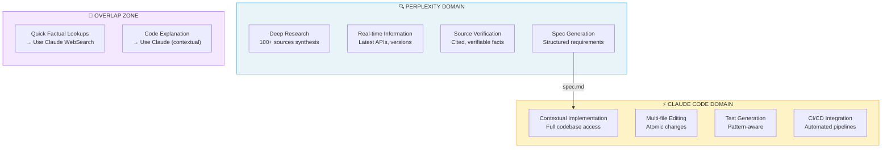
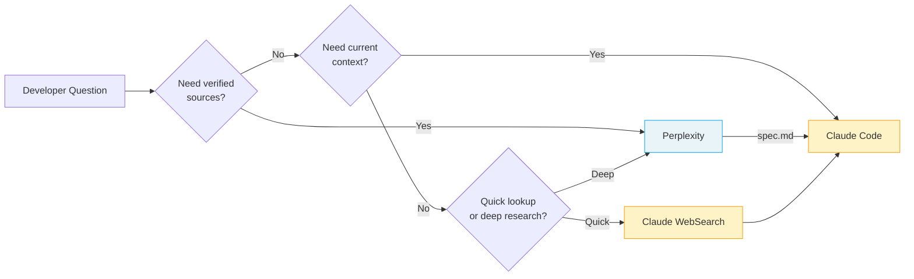
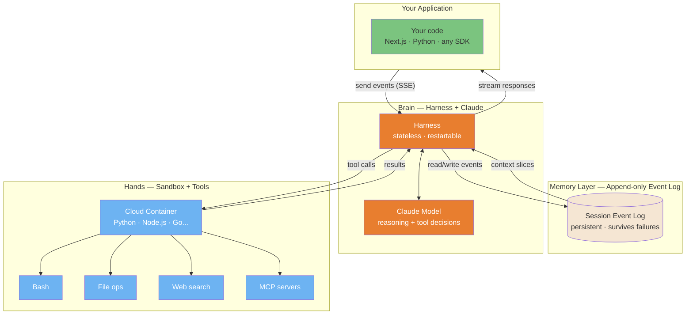
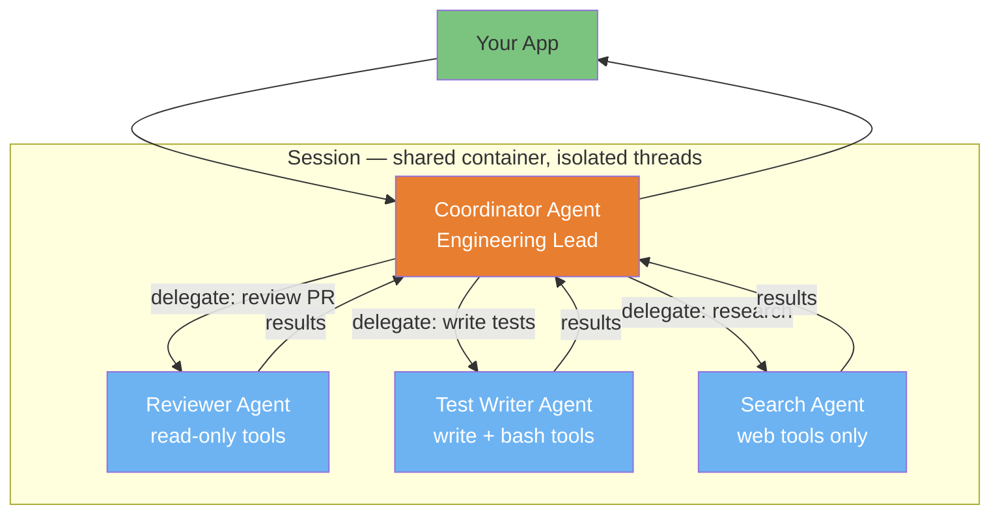

# AI Ecosystem: Maximizing Claude Code with Complementary Tools

> **Reading time**: ~25 minutes
>
> **Purpose**: This guide helps you understand when to use Claude Code vs. complementary AI tools, and how to chain them for optimal workflows.

---

## Table of Contents

- [Introduction](#introduction)
- [1. Perplexity AI (Research & Sourcing)](#1-perplexity-ai-research--sourcing)
- [2. Google Gemini (Visual Understanding)](#2-google-gemini-visual-understanding)
- [3. Kimi (PPTX & Long Document Generation)](#3-kimi-pptx--long-document-generation)
- [4. NotebookLM (Synthesis & Audio)](#4-notebooklm-synthesis--audio)
- [5. Voice-to-Text Tools (Wispr Flow, Superwhisper)](#5-voice-to-text-tools-wispr-flow-superwhisper)
- [6. IDE-Based Tools (Cursor, Windsurf, Cline)](#6-ide-based-tools-cursor-windsurf-cline)
- [6.1 Google Antigravity (Agent-First IDE)](#61-google-antigravity-agent-first-ide)
- [7. UI Prototypers (v0, Bolt, Lovable)](#7-ui-prototypers-v0-bolt-lovable)
- [7.1 Generative UI: Agent-Driven Interactive Output Formats](#71-generative-ui-agent-driven-interactive-output-formats)
- [8. Workflow Orchestration](#8-workflow-orchestration)
- [9. Cost & Subscription Strategy](#9-cost--subscription-strategy)
- [10. Claude Cowork (Research Preview)](#10-claude-cowork-research-preview)
- [11. AI Coding Agents Matrix](#11-ai-coding-agents-matrix)
- [11.1 Goose: Open-Source Alternative (Block)](#111-goose-open-source-alternative-block)
- [11.2 Practitioner Insights](#112-practitioner-insights)
- [11.3 When to Build vs Use](#113-when-to-build-vs-use)
- [11.4 Skills Distribution Platforms](#114-skills-distribution-platforms)
- [12. Context Packing Tools](#12-context-packing-tools)
- [14. Claude Managed Agents (Cloud-Hosted Platform)](#14-claude-managed-agents-cloud-hosted-platform)
- [15. Project Glasswing & Claude Mythos Preview (Defensive Security)](#15-project-glasswing--claude-mythos-preview-defensive-security)
- [16. Step by Token: How LLMs Work (Interactive Guide)](#16-step-by-token-how-llms-work-interactive-guide)
- [Appendix: Ready-to-Use Prompts](#appendix-ready-to-use-prompts)
- [Alternative Providers (Community Workarounds)](#alternative-providers-community-workarounds)

---

## Introduction

### Philosophy: Augmentation, Not Replacement

Claude Code excels at:
- **Contextual reasoning** across entire codebases
- **Multi-file implementation** with test integration
- **Persistent memory** via CLAUDE.md files
- **CLI automation** for CI/CD pipelines
- **Agentic task completion** with minimal supervision

What Claude Code doesn't do well (by design):
- **Real-time web search with source verification** (WebSearch exists but limited)
- **Image generation** (no native capability)
- **PowerPoint/slide generation** (no PPTX output)
- **Audio synthesis** (no TTS)
- **Browser-based prototyping** (no visual preview)

The goal is not to find "better" tools, but to chain the **right tool for each step**.

### The Complementarity Matrix

| Task | Claude Code | Better Alternative | Why |
|------|-------------|-------------------|-----|
| **Code implementation** | ✅ Best | - | Contextual reasoning + file editing |
| **Deep research with sources** | ⚠️ Limited | Perplexity Pro | 100+ verified sources |
| **Image → Code** | ⚠️ Limited | Gemini 2.5+ | Superior visual understanding |
| **Slide generation** | ❌ None | Kimi.com | Native PPTX export |
| **Audio overview** | ❌ None | NotebookLM | Podcast-style synthesis |
| **Browser prototyping** | ❌ None | v0.dev, Bolt | Live preview |
| **IDE autocomplete** | ❌ None | Copilot, Cursor | Inline suggestions |

---

## 1. Perplexity AI (Research & Sourcing)

### Complementarity Diagram

The following diagram illustrates how Perplexity and Claude Code complement each other across the development workflow:



**Key Insight**: Perplexity answers "What should we build?" → Claude Code answers "How do we build it here?"

### Decision Flow



### When to Use Perplexity Over Claude

| Scenario | Use Perplexity | Use Claude |
|----------|---------------|------------|
| "What's the latest API for X?" | ✅ | ⚠️ Knowledge cutoff |
| "Compare 5 libraries for auth" | ✅ Sources | ⚠️ May hallucinate |
| "Explain this error message" | ⚠️ Generic | ✅ Contextual |
| "Implement auth in my codebase" | ❌ No files | ✅ Full access |

### Perplexity Pro Features for Developers

**Deep Research Mode**
- Synthesizes 100+ sources into structured output
- Takes 3-5 minutes but produces comprehensive specs
- Export as markdown → Feed to Claude Code

**Model Selection**
- Claude Sonnet 4: Best for technical prose and documentation
- GPT-4o: Good for code snippets
- Sonar Pro: Fast factual lookups

**Labs Features**
- Spaces: Persistent project contexts
- Code blocks: Syntax-highlighted exports
- Charts: Auto-generated from data

### Integration Workflow

#### Pattern 1: Research → Spec → Code

```
┌─────────────────────────────────────────────────────────┐
│ 1. PERPLEXITY (Deep Research)                           │
│    "Research best practices for JWT refresh tokens      │
│     in Next.js 15. Include security considerations,     │
│     common pitfalls, and library recommendations."      │
│                                                         │
│    → Output: 2000-word spec with sources               │
└───────────────────────────┬─────────────────────────────┘
                            ↓ Export as spec.md
┌─────────────────────────────────────────────────────────┐
│ 2. CLAUDE CODE                                          │
│    > claude                                             │
│    "Implement JWT refresh tokens following spec.md.     │
│     Use the jose library as recommended."               │
│                                                         │
│    → Output: Working implementation with tests         │
└─────────────────────────────────────────────────────────┘
```

#### Pattern 2: Parallel Pane Workflow

Using tmux or terminal split:

```bash
# Left pane: Perplexity (browser or CLI)
perplexity "Best practices for rate limiting in Express"

# Right pane: Claude Code (implementing)
claude "Add rate limiting to API. Check spec.md for approach."
```

### Comparison: Claude WebSearch vs Perplexity

| Feature | Claude WebSearch | Perplexity Pro |
|---------|-----------------|----------------|
| Source count | ~5-10 | 100+ (Deep Research) |
| Source verification | Basic | Full citations |
| Real-time data | Yes | Yes |
| Export format | Text in context | Markdown, code blocks |
| Best for | Quick lookups | Comprehensive research |
| Cost | Included | $20/month Pro |

**Recommendation**: Use Claude WebSearch for quick factual checks. Use Perplexity Deep Research before any significant implementation that requires understanding the ecosystem.

---

## 2. Google Gemini (Visual Understanding)

### Developer Use Cases

**Gemini's Visual Superpowers**:
- UI mockup → HTML/CSS/React code (90%+ fidelity)
- Diagram interpretation (flowcharts → Mermaid/code)
- Screenshot debugging ("why does this look broken?")
- Design token extraction (colors, spacing from images)

### Gemini 2.5 Pro for Development

Best-in-class for:
- **Complex UI conversion**: Upload Figma screenshot → Get Tailwind components
- **Diagram comprehension**: Architecture diagrams → Implementation plan
- **Error analysis**: Upload error screenshot → Get debugging steps

Model selection:
- **Gemini 2.5 Pro**: Complex visual reasoning, long context
- **Gemini 2.5 Flash**: Quick visual tasks, lower cost

### Integration Workflow

#### Pattern: Visual → Code

```
┌─────────────────────────────────────────────────────────┐
│ 1. GEMINI 2.5 PRO                                       │
│    Upload: screenshot.png of Figma design               │
│    Prompt: "Convert this to a React component using     │
│            Tailwind CSS. Use semantic HTML and          │
│            include responsive breakpoints."             │
│                                                         │
│    → Output: JSX + Tailwind code                       │
└───────────────────────────┬─────────────────────────────┘
                            ↓ Copy to clipboard
┌─────────────────────────────────────────────────────────┐
│ 2. CLAUDE CODE                                          │
│    > claude                                             │
│    "Refine this component for our Next.js project.      │
│     Add proper TypeScript types, our Button component,  │
│     and connect to the auth context."                   │
│                                                         │
│    → Output: Production-ready component                │
└─────────────────────────────────────────────────────────┘
```

#### Pattern: Diagram → Implementation Plan

```
┌─────────────────────────────────────────────────────────┐
│ 1. GEMINI                                               │
│    Upload: architecture-diagram.png                     │
│    Prompt: "Analyze this architecture diagram.          │
│            Output a Mermaid diagram with the same       │
│            structure, and list the components."         │
│                                                         │
│    → Output: Mermaid code + component list             │
└───────────────────────────┬─────────────────────────────┘
                            ↓ Paste mermaid to CLAUDE.md
┌─────────────────────────────────────────────────────────┐
│ 2. CLAUDE CODE                                          │
│    "Implement the UserService component from the        │
│     architecture in CLAUDE.md. Start with the           │
│     interface, then the implementation."                │
│                                                         │
│    → Output: Implemented service                       │
└─────────────────────────────────────────────────────────┘
```

### Image Generation Alternatives

For generating diagrams, mockups, or visual assets:

| Tool | Best For | Format | Quality |
|------|----------|--------|---------|
| Ideogram 3.0 | UI mockups, icons | PNG, SVG | High |
| Recraft v3 | Vectors, logos | SVG, PNG | Very high |
| Midjourney | Artistic visuals | PNG | Artistic |
| DALL-E 3 | Quick concepts | PNG | Good |

**Workflow for generated images**:
1. Generate image with tool of choice
2. Upload to Gemini for → code conversion
3. Refine with Claude Code

---

## 3. Kimi (PPTX & Long Document Generation)

### What is Kimi?

[Kimi](https://kimi.ai) is Moonshot AI's assistant, notable for:
- **Native PPTX generation** (actual slides, not markdown)
- **128K+ token context** (entire codebases)
- **Code-aware layouts** (syntax highlighting in slides)
- **Multilingual** (excellent Chinese/English)

### Developer Use Cases

**Presentation Generation**:
- PR summary → stakeholder deck
- Architecture docs → visual presentation
- Technical spec → team onboarding slides
- Code walkthrough → training materials

### Integration Workflow

#### Pattern: Code → Presentation

```
┌─────────────────────────────────────────────────────────┐
│ 1. CLAUDE CODE                                          │
│    "Generate a summary of all changes in the last       │
│     5 commits. Format as markdown with sections:        │
│     Overview, Key Changes, Breaking Changes, Migration."│
│                                                         │
│    → Output: changes-summary.md                        │
└───────────────────────────┬─────────────────────────────┘
                            ↓ Upload to Kimi
┌─────────────────────────────────────────────────────────┐
│ 2. KIMI                                                 │
│    Prompt: "Create a 10-slide presentation from this    │
│            summary for non-technical stakeholders.      │
│            Use business-friendly language.              │
│            Include one slide per major feature."        │
│                                                         │
│    → Output: stakeholder-update.pptx                   │
└─────────────────────────────────────────────────────────┘
```

#### Pattern: Architecture → Training

```
┌─────────────────────────────────────────────────────────┐
│ 1. CLAUDE CODE (using /explain or equivalent)           │
│    "Explain the authentication flow in this project.    │
│     Include sequence diagrams (mermaid) and key files." │
│                                                         │
│    → Output: auth-explanation.md with diagrams         │
└───────────────────────────┬─────────────────────────────┘
                            ↓ Upload to Kimi
┌─────────────────────────────────────────────────────────┐
│ 2. KIMI                                                 │
│    "Create an onboarding presentation for new devs.     │
│     20 slides covering the auth system. Include         │
│     code snippets and diagrams where relevant."         │
│                                                         │
│    → Output: auth-onboarding.pptx                      │
└─────────────────────────────────────────────────────────┘
```

### Comparison: Presentation Tools

| Tool | Strengths | Weaknesses | Best For |
|------|-----------|------------|----------|
| **Kimi** | Native PPTX, code-aware | Less design polish | Technical decks |
| **Gamma.app** | Beautiful templates | Less code support | Business decks |
| **Tome** | AI-native, visual | Expensive | Marketing |
| **Beautiful.ai** | Smart templates | Manual | Design-focused |
| **Marp** | Markdown → slides | Manual styling | Developer decks |

**Recommendation**: Use Kimi for technical content with code. Use Gamma for business/investor decks.

---

## 4. NotebookLM (Synthesis & Audio)

### Developer Use Cases

**Documentation Synthesis**:
- Upload 50+ files → Get unified understanding
- Ask questions about your codebase
- Generate audio overview for commute learning

**Audio Overview Feature**:
- Generates 10-15 minute "podcast" from uploaded content
- Two AI hosts discuss your documentation
- Perfect for onboarding or reviewing large systems

### Integration Workflow

#### Pattern: Codebase → Audio Onboarding

```
┌─────────────────────────────────────────────────────────┐
│ 1. EXPORT (via Claude Code or manual)                   │
│    "Export all markdown files from docs/ and the        │
│     main README to a single combined-docs.md file."     │
│                                                         │
│    → Output: combined-docs.md (50K tokens)             │
└───────────────────────────┬─────────────────────────────┘
                            ↓ Upload to NotebookLM
┌─────────────────────────────────────────────────────────┐
│ 2. NOTEBOOKLM                                           │
│    - Add combined-docs.md as source                     │
│    - Click "Generate Audio Overview"                    │
│    - Wait 3-5 minutes for generation                    │
│                                                         │
│    → Output: 12-minute audio explaining your system    │
└───────────────────────────┬─────────────────────────────┘
                            ↓ Listen during commute
┌─────────────────────────────────────────────────────────┐
│ 3. BACK TO CLAUDE CODE                                  │
│    "Based on my notes from the audio overview:          │
│     [paste notes]                                       │
│     Help me understand the auth flow in more detail."   │
│                                                         │
│    → Output: Contextual deep-dive                      │
└─────────────────────────────────────────────────────────┘
```

#### Pattern: Multi-Source Synthesis

```
┌─────────────────────────────────────────────────────────┐
│ NOTEBOOKLM                                              │
│ Upload multiple sources:                                │
│ - Your codebase docs (combined-docs.md)                 │
│ - Framework documentation (Next.js docs PDF)           │
│ - Related articles (URLs or PDFs)                      │
│                                                         │
│ Ask: "How does our auth implementation compare to       │
│       Next.js best practices?"                         │
│                                                         │
│    → Output: Comparative analysis with citations       │
└─────────────────────────────────────────────────────────┘
```

### Export to CLAUDE.md

After NotebookLM synthesis, export key insights to your project:

```markdown
## Architecture Insights (from NotebookLM synthesis)

### Key Patterns
- Service layer uses repository pattern
- Auth flow follows OAuth2 with PKCE
- State management via React Query

### Potential Issues Identified
- Token refresh logic not documented
- Missing error boundaries in critical paths

### Recommendations
- Add token refresh documentation
- Implement error boundary audit
```

---

## 4.1 NotebookLM MCP Integration

**Available since**: Claude Code v2.1+ with MCP support

**What it does**: Query your NotebookLM notebooks directly from Claude Code, maintaining conversation context across multiple questions.

### Installation

```bash
# Install NotebookLM MCP server
claude mcp add notebooklm npx notebooklm-mcp@latest

# Configure profile (optional, add to ~/.zshrc or ~/.bashrc)
export NOTEBOOKLM_PROFILE=standard  # minimal (5 tools) | standard (10 tools) | full (16 tools)

# Verify installation
claude mcp list
# Should show: notebooklm: npx notebooklm-mcp@latest - ✓ Connected
```

**Profile comparison**:

| Profile | Tools | Use Case |
|---------|-------|----------|
| `minimal` | 5 | Basic queries, token-constrained environments |
| `standard` | 10 | **Recommended** - Queries + library management |
| `full` | 16 | Advanced (browser control, cleanup, re-auth) |

**Detailed tool breakdown**:

| Tool | minimal | standard | full | Description |
|------|---------|----------|------|-------------|
| `ask_question` | ✅ | ✅ | ✅ | Query notebooks with conversation context |
| `add_notebook` | ✅ | ✅ | ✅ | Add notebook to library |
| `list_notebooks` | ✅ | ✅ | ✅ | List all notebooks in library |
| `get_notebook` | ✅ | ✅ | ✅ | Get notebook details by ID |
| `setup_auth` | ✅ | ✅ | ✅ | Initial Google authentication |
| `select_notebook` | ❌ | ✅ | ✅ | Set active notebook |
| `update_notebook` | ❌ | ✅ | ✅ | Update notebook metadata |
| `search_notebooks` | ❌ | ✅ | ✅ | Search library by keywords |
| `list_sessions` | ❌ | ✅ | ✅ | List active conversation sessions |
| `get_health` | ❌ | ✅ | ✅ | Check auth status and config |
| `remove_notebook` | ❌ | ❌ | ✅ | Remove notebook from library |
| `re_auth` | ❌ | ❌ | ✅ | Switch Google account |
| `cleanup_data` | ❌ | ❌ | ✅ | Clear browser data and sessions |
| `get_browser_state` | ❌ | ❌ | ✅ | Manual browser state inspection |
| `execute_browser_action` | ❌ | ❌ | ✅ | Manual browser control |
| `wait_for_element` | ❌ | ❌ | ✅ | Manual browser element waiting |

### Authentication

**Important**: NotebookLM MCP uses isolated Chrome profile, separate from your main browser session.

```bash
# In Claude Code, first-time setup:
"Log me in to NotebookLM"

# Browser opens automatically for Google authentication
# Select your Google account (pro tip: use authuser=1 for secondary accounts)
# Session persists in: ~/Library/Application Support/notebooklm-mcp/
```

**Multi-account setup**:

If you have multiple Google accounts and want to use a specific one:

1. **Pre-configure in browser**: Open `https://notebooklm.google.com/?authuser=1` (change number for different accounts)
2. Sign in with desired account
3. **Then** run authentication in Claude Code

The MCP stores credentials in an isolated Chrome profile, so your main browser cookies don't affect it.

**Verify authentication**:

```bash
"Check NotebookLM health status"

# Expected output after successful auth:
# {
#   "authenticated": true,
#   "account": "your-email@gmail.com",
#   "notebooks": <count>
# }
```

### Building Your Notebook Library

Unlike the web UI, the MCP works with **share links** rather than auto-syncing all notebooks.

**Add a notebook**:

```bash
# 1. In NotebookLM web UI:
#    - Open notebook
#    - Click "Share" → "Anyone with the link"
#    - Copy share URL

# 2. In Claude Code:
"Add notebook: https://notebooklm.google.com/notebook/abc123...
Name: LLM Engineer Handbook
Description: Comprehensive guide on LLM engineering practices
Topics: LLM, fine-tuning, RAG, deployment"

# Minimal metadata required - the MCP will analyze content automatically
```

**List your library**:

```bash
"List my NotebookLM notebooks"

# Shows all added notebooks with topics, use cases, last used
```

**Search library**:

```bash
"Search NotebookLM library for: React patterns"

# Returns relevant notebooks based on name, description, topics
```

### Querying Notebooks

**Direct query** (specify notebook):

```bash
"In LLM Engineer Handbook, how do I implement RAG with embeddings?"

# Claude will:
# 1. Select the specified notebook
# 2. Query NotebookLM with your question
# 3. Return answer with precise citations
# 4. Maintain session_id for follow-up questions
```

**Contextual conversation**:

```bash
# First question
"In Building Large-Scale Web Apps notebook, what are the caching strategies?"

# Follow-up (uses same session_id)
"How would that apply to a Next.js application?"

# Another follow-up
"What about Redis vs in-memory cache trade-offs?"

# Session context is maintained across all queries
```

**Select active notebook**:

```bash
"Select LLM Engineer Handbook as active notebook"

# Now you can ask without specifying notebook each time
"What are the fine-tuning techniques?"
"How does DPO compare to RLHF?"
```

### Advanced Workflows

**Multi-notebook research**:

```bash
# Compare insights across notebooks
"What does LLM Engineer Handbook say about embeddings?"
"Now check Playwright Automation guide for testing strategies"
"How can I combine these approaches?"
```

**Update notebook metadata**:

```bash
# As you use notebooks, refine their metadata
"Update LLM Engineer Handbook:
 - Add topic: prompt engineering
 - Add use case: When designing LLM architectures"

# This helps Claude auto-select the right notebook for future queries
```

**Session management**:

```bash
"List active NotebookLM sessions"

# Shows all conversation sessions with message counts, age
# Useful to resume previous research threads
```

### Comparison: MCP vs Web UI

| Feature | MCP Integration | Web UI |
|---------|----------------|--------|
| Access from Claude Code | ✅ Direct | ❌ Manual copy-paste |
| Conversation context | ✅ Persistent session_id | ⚠️ Web chat only |
| Multi-notebook queries | ✅ Switch seamlessly | ⚠️ Manual navigation |
| Audio generation | ❌ Use web UI | ✅ Native |
| Share notebooks | ✅ Via library | ✅ Native |
| Query speed | ✅ Instant | ⚠️ Browser navigation |

**Best practice**: Use **MCP for queries** during development, **web UI for audio generation** during onboarding.

### Troubleshooting

| Issue | Solution |
|-------|----------|
| `notebooklm: not connected` | Run `source ~/.zshrc` (or restart terminal), then restart Claude Code |
| Empty notebook list after auth | You're authenticated but haven't added notebooks yet - use share links workflow |
| Wrong Google account | Clear auth: delete `~/Library/Application Support/notebooklm-mcp/chrome_profile/`, re-authenticate |
| "Tool not found" | Check `NOTEBOOKLM_PROFILE` variable is set correctly |
| Rate limit errors | Wait 24h or re-authenticate with different Google account |

**Check MCP configuration**:

```bash
# View your .claude.json MCP config
cat ~/.claude.json | jq '.mcpServers.notebooklm'

# Should show:
# {
#   "type": "stdio",
#   "command": "npx",
#   "args": ["notebooklm-mcp@latest"],
#   "env": {}
# }
```

### Example: Onboarding Workflow

```bash
# Day 1: Setup
"Log me in to NotebookLM"
"Add notebook: <share-link-1> - Codebase Architecture"
"Add notebook: <share-link-2> - API Documentation"

# Day 2: Research
"In Codebase Architecture, what's the auth flow?"
"How does that integrate with the API docs?"
"Select API Documentation notebook"
"What are the rate limiting strategies?"

# Week 2: Advanced
"Search library for: database patterns"
"In Database Patterns notebook, explain connection pooling"
"How would I implement this in our codebase?"
```

---

## 4.2 Advanced Features (Full Profile)

**When to use `full` profile**:
- Need to switch Google accounts frequently (`re_auth`)
- Want to clean up MCP data without manual file deletion (`cleanup_data`)
- Need to remove notebooks from library (`remove_notebook`)
- Advanced debugging requiring manual browser control

**Enable full profile**:

```bash
# Add to ~/.zshrc or ~/.bashrc
export NOTEBOOKLM_PROFILE=full

# Restart Claude Code
```

### Remove Notebook from Library

```bash
"Remove notebook: LLM Engineer Handbook"

# Or by ID:
"Remove notebook with ID: llm-engineer-handbook"
```

**Use case**: Declutter library, remove outdated notebooks, fix duplicate entries.

### Re-authentication (Account Switching)

**Scenario**: You want to switch from personal Google account to work account.

```bash
"Re-authenticate NotebookLM with different account"

# Browser opens, select different Google account
# New credentials saved, old session cleared
```

**Difference vs `setup_auth`**:
- `setup_auth`: First-time authentication
- `re_auth`: Switch accounts (clears existing session)

**Important**: After re-auth, your notebook library is **preserved** (stored locally), but you'll need to verify access to notebooks (they must be shared with new account).

### Cleanup Data

**Scenario**: Start fresh, clear all MCP data (auth, library, browser profile).

```bash
"Clean up NotebookLM MCP data"

# Options:
# - preserve_library: Keep notebook metadata (default: false)
# - confirm: Safety confirmation (default: false)
```

**What gets deleted**:
- Browser profile (`~/Library/Application Support/notebooklm-mcp/chrome_profile/`)
- Authentication cookies
- Active sessions
- Notebook library (unless `preserve_library=true`)

**When to use**:
- Authentication issues not resolved by re-auth
- Browser conflicts or corruption
- Starting fresh after testing
- Before uninstalling MCP

**Example**:

```bash
"Clean NotebookLM data but keep my library"
# → cleanup_data(preserve_library=true, confirm=true)

"Completely reset NotebookLM MCP"
# → cleanup_data(preserve_library=false, confirm=true)
```

### Manual Browser Control

**Advanced debugging tools** (full profile only):

**1. Get browser state**:

```bash
"Show NotebookLM browser state"

# Returns: current_url, cookies, local_storage, session_storage
```

**2. Execute browser action**:

```bash
"Navigate NotebookLM browser to specific notebook URL"
"Click element in NotebookLM browser"
"Type text in NotebookLM browser"
```

**3. Wait for element**:

```bash
"Wait for element to load in NotebookLM browser"
```

**Use case**: Debugging authentication issues, inspecting browser state during failures, manual notebook navigation.

---

## 4.3 Browser Options (All Profiles)

Control browser behavior for queries and authentication.

### Available Options

```javascript
{
  // Visibility
  "headless": true,        // Run without visible window (default: true)
  "show": false,          // Show browser window (default: false)

  // Performance
  "timeout_ms": 30000,    // Operation timeout (default: 30000)

  // Viewport
  "viewport": {
    "width": 1920,        // Default: 1920
    "height": 1080        // Default: 1080
  },

  // Stealth mode (human-like behavior)
  "stealth": {
    "enabled": true,           // Master switch (default: true)
    "human_typing": true,      // Simulate typing speed (default: true)
    "random_delays": true,     // Random pauses (default: true)
    "mouse_movements": true,   // Realistic mouse moves (default: true)
    "typing_wpm_min": 160,     // Min typing speed (default: 160)
    "typing_wpm_max": 240,     // Max typing speed (default: 240)
    "delay_min_ms": 100,       // Min delay between actions (default: 100)
    "delay_max_ms": 400        // Max delay between actions (default: 400)
  }
}
```

### Usage Examples

**Debug authentication visually**:

```bash
"Log me in to NotebookLM with visible browser"

# Claude calls: setup_auth(show_browser=true)
```

**Custom timeout for slow connections**:

```bash
"Ask NotebookLM (with 60s timeout): What are the main concepts?"

# Claude calls: ask_question(timeout_ms=60000, ...)
```

**Disable stealth for faster queries** (if rate limits not a concern):

```bash
# Advanced: requires direct tool call (not natural language)
ask_question(
  question="...",
  browser_options={
    "stealth": {"enabled": false},
    "timeout_ms": 10000
  }
)
```

**When to customize**:
- **Show browser**: Debugging auth issues, verifying account selection
- **Increase timeout**: Slow network, large notebooks, complex queries
- **Disable stealth**: Local testing, debugging, speed priority
- **Custom viewport**: Testing responsive notebook UI (rare)

---

## 4.4 Session Management

NotebookLM MCP maintains conversation context across queries via `session_id`.

### How Sessions Work

```bash
# First query → Creates session
"In LLM Engineer Handbook, what is RAG?"
# → Returns session_id: "abc123"

# Follow-up → Uses same session
"How does it compare to fine-tuning?"
# → Uses session_id: "abc123" automatically

# Another notebook → New session
"In Playwright Guide, how do I test?"
# → New session_id: "xyz789"
```

**Session properties**:
- **Automatic**: Claude manages session_id for follow-up questions
- **Scoped**: One session per notebook per conversation
- **Timeout**: 15 minutes of inactivity (configurable)
- **Max sessions**: 10 concurrent (configurable)

### List Active Sessions

```bash
"List my active NotebookLM sessions"

# Returns:
# - session_id
# - notebook_name
# - age_seconds
# - message_count
# - last_activity (timestamp)
```

**Use case**: Resume previous research threads, understand query history, debug context issues.

### Manual Session Control

**Resume specific session**:

```bash
"Continue NotebookLM session abc123 with question: What about embeddings?"

# Claude calls: ask_question(session_id="abc123", question="...")
```

**Force new session** (ignore context):

```bash
"Ask NotebookLM in fresh session: What is RAG?"

# Claude omits session_id to create new session
```

**Session cleanup**:

Sessions auto-expire after 15 minutes. Manual cleanup via `cleanup_data`.

---

## 4.5 Library Management Best Practices

### Organizing Notebooks

**Naming conventions**:

```bash
# Good: Descriptive, searchable
"LLM Engineer Handbook"
"Playwright Testing Guide"
"Next.js Architecture Patterns"

# Bad: Vague, unhelpful
"Notebook 1"
"My Docs"
"Tech Stuff"
```

**Topics strategy**:

```bash
# Specific, hierarchical
topics: ["RAG", "embeddings", "vector databases", "LLM fine-tuning"]

# Too broad
topics: ["AI", "programming"]
```

**Use cases** (helps Claude auto-select):

```bash
# Action-oriented
use_cases: [
  "When implementing RAG systems",
  "For fine-tuning LLM models",
  "To understand embeddings architecture"
]
```

### Metadata Refinement Workflow

After using a notebook, refine its metadata:

```bash
# Initial add (minimal)
"Add notebook: <url>
Name: TypeScript Guide
Description: TypeScript best practices
Topics: TypeScript, types"

# After usage (refine)
"Update TypeScript Guide:
 - Add topic: generics
 - Add topic: utility types
 - Add use case: When designing type-safe APIs
 - Add tag: advanced"
```

### Search and Discovery

**Keyword search**:

```bash
"Search library for: React hooks"
"Search library for: testing"
"Search library for: architecture patterns"
```

**Smart selection** (Claude decides):

```bash
"Which notebook should I consult about database design?"
# Claude searches library, proposes best match

"I need help with TypeScript generics"
# Claude auto-selects TypeScript Guide if metadata matches
```

### Notebook Lifecycle

```bash
# 1. Add
"Add notebook: <url> - Name: X, Description: Y, Topics: Z"

# 2. Use
"In X notebook, ask: ..."

# 3. Refine
"Update X: Add topic: ..., Add use case: ..."

# 4. Archive (full profile)
"Remove notebook: X"  # If outdated or duplicate
```

### Cost

**Free**: NotebookLM (including MCP integration) is free with Google account

**Limits**:
- Free tier: 100 notebooks, 50 sources per notebook, 500K words, 50 daily queries
- Google AI Premium/Ultra: 5x higher limits

---

## 5. Voice-to-Text Tools (Wispr Flow, Superwhisper)

**Philosophy**: "Vibe coding" — dictate intent, let AI implement

Voice input delivers ~4x typing speed (~150 WPM vs ~40 WPM) with richer context.
You say more when you don't have to type it.

### Tool Comparison

| Tool | Processing | Latency | Privacy | Price | Platform |
|------|------------|---------|---------|-------|----------|
| **Wispr Flow** | Cloud | ~500ms | SOC 2 certified | $12/mo | Mac, Win, iOS |
| **Superwhisper** | Local | 1-2s | 100% offline | ~$50 one-time | Mac only |
| **MacWhisper** | Local | Variable | 100% offline | $49 one-time | Mac only |

### When Voice + Claude Code Shines

| Scenario | Why voice wins |
|----------|---------------|
| Long context dumps | You naturally include constraints, edge cases, business context |
| Brainstorming | Less self-filtering, more raw ideas |
| Multi-agent management | Dictate to 3-4 Claude sessions simultaneously |
| Accessibility | RSI, mobility constraints, eye strain |

### Vibe Coding Workflow

1. Open Claude Code or Cursor
2. Activate voice (Wispr hotkey or system dictation)
3. Dictate naturally: "I need a component that shows user stats,
   it should have pagination because we have thousands of users,
   and sorting by name or signup date, use our existing Tailwind setup"
4. Let Claude process the verbose input
5. Iterate vocally: "Add loading state and error handling"

### Trade-offs

| Advantage | Limitation |
|-----------|------------|
| ~4x faster input | ~3x more verbose output |
| Richer context | Cloud privacy (Wispr) |
| Flow state preserved | ~800MB RAM overhead |
| Natural expression | Technical terms need training |

### Recommendation

| Profile | Tool |
|---------|------|
| Productivity-first | Wispr Flow Pro ($12/mo) |
| Privacy-required | Superwhisper (Mac) |
| Budget-conscious | MacWhisper ($49 one-time) |
| Windows user | Wait for Wispr stability improvements |

**Pro tip**: For complex prompts, consider a "refine" step to compress
verbose voice input into structured prompts before sending to Claude.
See `/voice-refine` skill template in `examples/skills/`.

---

## 5.1 Text-to-Speech Tools (Agent Vibes)

**Philosophy**: Audible narration frees your eyes for multitasking

Text-to-speech adds audio narration to Claude Code responses, enabling:
- **Code reviews while multitasking** (listen while reviewing diffs visually)
- **Long debugging sessions** (audio notifications keep you informed)
- **Accessibility** (visual impairment, eye strain, RSI)
- **Background monitoring** (alerts for errors/completion)

### Tool: Agent Vibes (Community MCP Server)

**Status**: Optional integration (not official Claude Code feature)
**Cost**: 100% free (offline TTS)
**Maintenance**: Community-driven (Paul Preibisch)

| Feature | Value |
|---------|-------|
| **Provider** | Piper TTS (offline neural) + macOS Say (native) |
| **Voices** | 15+ (12 English, 4 French including 124 multi-speakers) |
| **Quality** | ⭐️⭐️⭐️⭐️ (Piper medium), ⭐️⭐️⭐️⭐️⭐️ (Piper high) |
| **Latency** | ~280ms (Piper medium), ~50ms (macOS Say) |
| **Disk Space** | ~1.3GB (Piper + voices + audio effects) |
| **Installation** | ~18 minutes (5 phases, interactive) |

### When TTS Shines

| Scenario | Benefit |
|----------|---------|
| Code reviews | Listen to Claude's analysis while viewing code |
| Long-running tasks | Audio notification when tests/builds complete |
| Debugging sessions | Error alerts without constant screen checking |
| Learning mode | Dual-language narration (main + target language) |
| Pair programming | One person codes, both hear Claude's feedback |

### Trade-offs

| Advantage | Limitation |
|-----------|------------|
| 100% offline | No cloud-quality voices (vs ElevenLabs) |
| Zero cost | ~280ms latency (vs instant macOS Say) |
| Multi-language (50+) | ~1GB disk space for voice models |
| 124 voice variety | Installation requires Homebrew, Bash 5.x |

### Quick Start

**Installation**: [TTS Setup Workflow](../workflows/tts-setup.md) (18 min)

**Basic usage**:
```bash
# In Claude Code
/agent-vibes:whoami          # Check current voice & provider
/agent-vibes:list            # List all 15 voices
/agent-vibes:switch fr_FR-tom-medium  # French male voice

# Test
> "Say hello in French"  # Audio narration plays
```

**Mute temporarily**:
```bash
/agent-vibes:mute    # Silent work
# ... focus time ...
/agent-vibes:unmute  # Re-enable
```

### Recommendation

| Profile | Setup |
|---------|-------|
| **Code reviewer** | ✅ Install with `fr_FR-tom-medium`, `verbosity: low` |
| **Focus worker** | ⚠️ Install but mute by default, unmute for notifications |
| **Battery-conscious** | Use macOS Say provider (instant, lower quality) |
| **Public workspace** | ❌ Skip TTS (audio distraction to others) |

### Complete Documentation

- **[Agent Vibes Integration Guide](../../examples/integrations/agent-vibes/README.md)** - Overview, commands, use cases
- **[Installation Guide](../../examples/integrations/agent-vibes/installation.md)** - 18-minute setup procedure
- **[Voice Catalog](../../examples/integrations/agent-vibes/voice-catalog.md)** - 15 voices with audio samples
- **[Troubleshooting](../../examples/integrations/agent-vibes/troubleshooting.md)** - Common issues & solutions

**Resources**:
- GitHub: https://github.com/paulpreibisch/AgentVibes
- Voice Samples: https://rhasspy.github.io/piper-samples/

---

## 6. IDE-Based Tools (Cursor, Windsurf, Cline)

> **Technical Comparison**: For an objective comparison of Claude Code vs 22+ alternatives across 11 criteria (MCP support, Skills, Commands, Subagents, Plan Mode), see the [AI Coding Agents Matrix](https://coding-agents-matrix.dev/) (updated Jan 2026).

### When IDE Tools Complement Claude Code

| Scenario | Use IDE Tool | Use Claude Code |
|----------|-------------|-----------------|
| Quick inline edits | ✅ Faster | ⚠️ Context switch |
| Autocomplete while typing | ✅ Essential | ❌ Not available |
| Multi-file refactoring | ⚠️ Limited | ✅ Superior |
| Understanding large codebase | ⚠️ Limited | ✅ Better context |
| CI/CD automation | ❌ Manual | ✅ Native |

### Hybrid Workflow

**Morning session (strategic)**:
```bash
claude "Review the auth module and suggest improvements"
# Claude analyzes, suggests multi-file refactoring plan
```

**During coding (tactical)**:
```
# In Cursor/VS Code with Copilot
# Quick autocomplete, inline suggestions
# Small function implementations
```

**Before commit (validation)**:
```bash
claude "Review my changes and suggest tests"
# Claude reviews diff, generates comprehensive tests
```

### Real-World Migration Path: Cursor → Windsurf → Claude Code

> **Source**: [Zadig&Voltaire Engineering Blog](https://tech.zadig-et-voltaire.com/blog/migration-nuxt/) — Benjamin Calef, Feb 2026

A 6-person team at Zadig&Voltaire documented their sequential tool adoption during a 6-month e-commerce rebuild (July 2025 – January 2026):

| Phase | Tool | Observation |
|-------|------|-------------|
| July 2025 | Cursor | Co-building workflow, inline suggestions |
| Aug 2025 | Windsurf | Similar paradigm, slightly different UX |
| Aug 2025 | **Claude Code** | Contextual understanding of entire codebase — pivot moment |
| Nov 2025 | Claude Opus 4.5 | Model comprehension leap, reliable code generation |

The team reported the pivot to Claude Code was driven by **codebase-level context** rather than file-level editing. They then integrated custom skills (`zv-commit`, `zv-code-review`, `zv-jira`, `zv-jira-qa`) and community skills from [skills.sh](https://skills.sh/) to standardize their workflows.

**Caveat**: Performance gains reported (-33% LOC, -63% LCP) are primarily attributable to the Nuxt 3 migration itself, not the AI tooling. The tool migration path is the transferable insight.

### Cursor-Specific Integration

Cursor's `.cursor/rules` can mirror your CLAUDE.md:

```markdown
# .cursor/rules
# Mirror from CLAUDE.md for consistency

## Conventions
- Use TypeScript strict mode
- Prefer named exports
- Test files: *.test.ts

## Patterns
- Services use dependency injection
- Components use render props for flexibility
```

### Multi-IDE Configuration Sync

When your team uses multiple AI coding tools (Claude Code + Cursor + Copilot), maintaining consistent conventions across all tools becomes a challenge.

#### The Problem

| Tool | Config File | Format |
|------|-------------|--------|
| Claude Code | `CLAUDE.md` | Markdown + @imports |
| Cursor | `.cursorrules` | Plain markdown |
| Codex/ChatGPT | `AGENTS.md` | AGENTS.md standard |
| Copilot | `.github/copilot-instructions.md` | GitHub-specific |

**Without sync**: Each file drifts independently → inconsistent AI behavior across tools.

#### Solution 1: Native @import (Recommended for Claude Code)

Claude Code supports `@path/to/file.md` imports natively:

```markdown
# CLAUDE.md
@docs/conventions/coding-standards.md
@docs/conventions/architecture.md
```

**Pros**: Native, no build step, maintained by Anthropic
**Cons**: Cursor/.cursorrules doesn't support @import

#### Solution 2: Script-Based Generation (Multi-IDE Teams)

For teams needing **identical conventions across all IDEs**:

```
docs/ai-instructions/           # Source of truth
├── core.md                     # Shared conventions
├── claude-specific.md          # Claude Code additions
├── cursor-specific.md          # Cursor additions
└── codex-specific.md           # AGENTS.md additions

        ↓ sync script (bash/node)

CLAUDE.md     = core + claude-specific
.cursorrules  = core + cursor-specific
AGENTS.md     = core + codex-specific
```

**Example sync script** (bash):

```bash
#!/bin/bash
CORE="docs/ai-instructions/core.md"

cat "$CORE" > CLAUDE.md
echo -e "\n---\n" >> CLAUDE.md
cat "docs/ai-instructions/claude-specific.md" >> CLAUDE.md

cat "$CORE" > .cursorrules
echo -e "\n---\n" >> .cursorrules
cat "docs/ai-instructions/cursor-specific.md" >> .cursorrules
```

**When to use this approach**:
- Team with mixed IDE preferences (Claude Code + Cursor + VS Code)
- Need to enforce identical conventions across all tools
- CI/CD validation of AI instructions

#### ⚠️ AGENTS.md Support Status

**Claude Code does NOT natively support AGENTS.md** ([GitHub issue #6235](https://github.com/anthropics/claude-code/issues/6235), 171 comments, still open as of Feb 2026).

**Workaround**: Symlink `ln -s AGENTS.md .claude/CLAUDE.md`

The AGENTS.md standard is supported by: Cursor, Windsurf, Cline, GitHub Copilot. See [AI Coding Agents Matrix](https://coding-agents-matrix.dev) for full compatibility.

### Export from IDE to Claude

When you need Claude's deeper analysis:

1. Select code in IDE
2. Copy with context (file path, line numbers)
3. Paste in Claude with: "Analyze this and suggest architectural improvements"

---

## 6.1 Google Antigravity (Agent-First IDE)

> **Source**: [Google Codelabs](https://codelabs.developers.google.com/getting-started-google-antigravity), [Google Cloud Blog](https://cloud.google.com/blog/topics/developers-practitioners/choosing-antigravity-or-gemini-cli), community reviews (Feb 2026)

Google Antigravity is an **agent-first IDE** (VS Code fork) launched late 2025. Unlike traditional IDE tools that add AI to an editor, Antigravity makes autonomous agents the primary interface — developers supervise through a mission control-style UI rather than writing code directly.

### Claude Code vs Antigravity: Two Philosophies

| Dimension | Claude Code | Google Antigravity |
|-----------|-------------|-------------------|
| **Paradigm** | Terminal-first, CLI-native | Agent-first, IDE-native |
| **Developer control** | Explicit approval per edit | Higher agent autonomy |
| **Context model** | Codebase-level via CLAUDE.md | Multi-surface (editor + browser + terminal) |
| **Multi-agent** | Agent Teams (v2.1+) | Built-in multi-agent orchestration |
| **CI/CD** | Native (headless, pipelines) | Not mature yet |
| **Risk profile** | Predictable, conservative | Higher autonomy = higher overstep risk |
| **Skills format** | `.claude/skills/` (YAML frontmatter) | Directory-based, different ecosystem |
| **Models** | Claude (Anthropic) | Multi-model (Gemini, Claude, Liquid AI) |

### Bridge: antigravity-claude-proxy

A community [npm package](https://www.npmjs.com/package/antigravity-claude-proxy) exposes an Anthropic-compatible API backed by Antigravity's Cloud Code service. This lets developers use Claude models through Antigravity's interface, or chain both tools in a single workflow.

### When to Consider Antigravity

| Scenario | Recommendation |
|----------|---------------|
| Rapid prototyping ("vibe coding") | Antigravity (higher autonomy, visual feedback) |
| Production code with CI/CD | Claude Code (predictable, headless, pipeline-native) |
| Multi-model experimentation | Antigravity (~150 models via OpenRouter) |
| Team standardization | Claude Code (CLAUDE.md, skills, hooks ecosystem) |
| Non-CLI developers | Antigravity (IDE-native, less terminal friction) |

### Trade-offs to Know

**Antigravity strengths**: Broader visual context (agents "see" browser + editor), parallel agent orchestration, lower barrier for non-CLI developers.

**Antigravity weaknesses**: Higher cognitive overhead (monitoring multiple agents), less predictable behavior, CI/CD not mature, destructive operations risk when agents act autonomously.

**Bottom line**: Claude Code optimizes for **predictability and integration with existing developer workflows**. Antigravity optimizes for **maximum agent autonomy with experimental trade-offs**. They serve different philosophies — choose based on your risk tolerance and workflow preferences.

---

## 7. UI Prototypers (v0, Bolt, Lovable)

### When to Use Prototypers

| Scenario | Use Prototyper | Use Claude Code |
|----------|---------------|-----------------|
| "Build a landing page" | ✅ v0 (visual) | ⚠️ No preview |
| "Add form to existing app" | ⚠️ Context needed | ✅ Has context |
| "Rapid UI iteration" | ✅ Live preview | ⚠️ Slower |
| "Match design system" | ⚠️ Generic | ✅ Reads your tokens |

### Tool Comparison

| Tool | Strengths | Stack | Best For |
|------|-----------|-------|----------|
| **v0.dev** | Shadcn/Tailwind | React | Component prototypes |
| **Bolt.new** | Full app scaffold | Various | Quick MVPs |
| **Lovable** | Design-to-code | React | Designer handoff |
| **WebSim** | Experimental UI | Web | Creative exploration |

### Integration Workflow

#### Pattern: Prototype → Production

```
┌─────────────────────────────────────────────────────────┐
│ 1. V0.DEV                                               │
│    Prompt: "A user profile card with avatar,            │
│            stats, and action buttons"                   │
│                                                         │
│    → Output: React + Shadcn component preview          │
│    → Export: Copy code                                 │
└───────────────────────────┬─────────────────────────────┘
                            ↓ Paste to clipboard
┌─────────────────────────────────────────────────────────┐
│ 2. CLAUDE CODE                                          │
│    "Adapt this v0 component for our Next.js app:        │
│     - Use our existing Button, Avatar components        │
│     - Add TypeScript types matching User interface      │
│     - Connect to getUserProfile API endpoint            │
│     - Add loading and error states"                     │
│                                                         │
│    → Output: Production-ready integrated component     │
└─────────────────────────────────────────────────────────┘
```

---

## 7.1 Generative UI: Agent-Driven Interactive Output Formats

### Why This Category Exists

UI prototypers (Section 7) generate a static app you paste into a codebase. A different problem is showing up in 2025-2026: an agent that needs to render an actual form, an approval gate, or a button *inside a single chat turn*, not as a separate artifact. Plain text can't collect structured input. A static screenshot can't dispatch an action. The response itself needs to be interactive, and it needs to come from a model call, often a small or fine-tuned one, not from a human writing JSX.

Four approaches are competing to solve this, with genuinely different assumptions about who renders the output and what the model has to produce.

| Approach | Vendor | What the model produces | Rendering | Portability |
|----------|--------|--------------------------|-----------|-------------|
| **A2UI** | Google | Structured UI description | Google ecosystem clients | Concept popularized by Google, not an independent standard |
| **MCP Apps** (SEP-1865) | Anthropic + OpenAI + MCP-UI (co-authored) | HTML/iframe payload via MCP tool response | Claude Desktop, VS Code, ChatGPT, Goose | Open protocol extension, multi-vendor from day one |
| **Vercel AI SDK generative UI** | Vercel | JSX / React components, streamed server-side (`streamUI`, `useObject`) | React only | Tied to the Vercel AI SDK and React |
| **MDMA** | MobileReality (open-source) | Markdown with embedded YAML, validated against a Zod schema | `@mobile-reality/mdma-renderer-react` (React only, as of this writing) | Spec/parser/validator/runtime packages have zero Node-specific imports, run in any JS runtime; the renderer itself doesn't |

These solve adjacent but distinct problems. MCP Apps is about a tool response carrying a UI. The Vercel AI SDK pattern is about the server choosing and streaming React components directly, so the client never parses an intermediate format. MDMA inverts that: the model produces validated YAML, and a client-side renderer interprets it, which trades some rendering flexibility for a format that's easier for a small or resource-constrained model to produce correctly. A third adjacent category is MCP Apps itself, already covered separately in this guide (`guide/core/architecture.md`, MCP Extensions section) since it's a protocol-level concern, not a rendering-format concern.

### Case Study: MDMA

[MDMA](https://github.com/MobileReality/mdma) is an open-source project built around one core idea: producing a syntactically valid, schema-conformant YAML block is a lower bar for a small LLM (their target is models like Gemini Flash, and they fine-tuned their own 26B model) than producing correct JSX or hand-written HTML. The engineering behind that idea holds up under audit. The marketing claims layered on top of it mostly don't.

**What holds up**:
- A real deterministic validator/fixer pipeline: one pass, no extra LLM call, regex-based extraction tolerant of broken markdown, 19 validation rules, ordered fixers (field-type inference, YAML key typo correction, binding repair).
- Standard parsing via remark/unified, with correct handling of streaming state (a plugin distinguishes a block still being generated from one that's actually malformed).
- Honest, measured evals using promptfoo with custom assertions, explicitly framed in their own docs as "observations, not conclusions." The headline number: 41% success rate with a bare prompt versus 90.5% with the DSL plus validator, on their fine-tuned model (`/Users/florianbruniaux/Sites/divers-test/mdma/evals/own-model/README.md`).
- "Runs anywhere" is true for the core packages (spec, parser, validator, runtime): zero Node-specific imports (`fs`, `path`, `crypto`), verified by direct grep across those four packages.
- CI with GitHub Actions pinned by commit SHA (a rare, good practice), changesets-based per-package versioning, and a real test suite (`turbo run test` across all packages, confirmed in `package.json`).

**What's overstated or misleading**:
- The implicit claim of guaranteed valid UI doesn't hold at the strict sense: 90.5% measured, not 100%. There's an unresolved contradiction in the repo itself: `evals/own-model/results.json` (`/Users/florianbruniaux/Sites/divers-test/mdma/evals/own-model/results.json`) shows a 95/95 pass, 100%, run on 2026-06-30, while the README states 90.5% for the same eval track. Nothing in the repo reconciles the two numbers.
- "Runs anywhere" doesn't extend to rendering. Exactly one renderer ships, `@mobile-reality/mdma-renderer-react`, 100% React. The default chart component isn't a chart: `ChartRenderer.tsx` parses CSV and renders an HTML `<table>`, with a code comment admitting as much ("Renders chart data as a simple HTML table," `/Users/florianbruniaux/Sites/divers-test/mdma/packages/renderer-react/src/components/ChartRenderer.tsx`).
- Webhooks aren't wired to anything. `WebhookRenderer.tsx` dispatches a UI event, `INTEGRATION_CALLED`, that the host application has to handle itself (`/Users/florianbruniaux/Sites/divers-test/mdma/packages/renderer-react/src/components/WebhookRenderer.tsx`). No HTTP call happens inside MDMA. To the project's credit, the corresponding webhook execution engine is listed as not-yet-built in their own roadmap docs, unlike the form validation gap below.
- "On-device / small models" describes the size of the *generator* model (hosted on Modal, distributed via Hugging Face), not anything about the rendered output. The renderer's CSS ships with zero `@media` queries (confirmed by grepping every `.css` file in the React renderer package), so there's no responsive design story here either.
- The demo site's "accessible by design" claim isn't backed by the code. The basics are there (native labels, native buttons, one `role="alert"` on the callout component), but there's no `aria-invalid` or `aria-live` anywhere in the renderer, and the PII-masking table cell is a clickable `<span>` with no `role="button"` and no `tabIndex`, meaning keyboard users can't reveal or hide it (`/Users/florianbruniaux/Sites/divers-test/mdma/packages/renderer-react/src/components/TableRenderer.tsx`, lines 4-15).

**The functional bug two independent audits both found**: form validation is never enforced. `FormRenderer.tsx` wraps fields in a plain `<div className="mdma-form">`, not a `<form>` element, and the submit control is `<button type="button">` with an `onClick` handler that dispatches an action directly (`/Users/florianbruniaux/Sites/divers-test/mdma/packages/renderer-react/src/components/FormRenderer.tsx`, lines 119-125 and 247-258). Native HTML5 constraint validation only triggers on a real form submit event, which never fires here. Worse, the field-level `validation` object (`pattern`, `min`, `max`) defined in the schema (`/Users/florianbruniaux/Sites/divers-test/mdma/packages/spec/src/schemas/components/form.ts`, line 18) and documented with worked examples in `/Users/florianbruniaux/Sites/divers-test/mdma/docs/reference/component-catalog.md` (including a pattern example matching a company email domain) is never read anywhere in the renderer. A field marked `required: true` can be submitted empty with no error shown. Unlike the webhook gap, which is honestly listed as future work, this one is documented as working, with a concrete example lifted from the repo's own `examples/approval-workflow/document.md`, and it silently doesn't work.

**Security note**: both the audit-log chain integrity and the PII redaction hash are non-cryptographic. `event-log-integrity.ts` uses FNV-1a, and the code comment says so directly ("Simple hash function for log chain integrity (non-cryptographic)," `/Users/florianbruniaux/Sites/divers-test/mdma/packages/runtime/src/core/event-log-integrity.ts`, line 10). The PII redaction hash in `hash.ts` is a djb2-style rolling hash, also flagged as non-cryptographic in its own comment (`/Users/florianbruniaux/Sites/divers-test/mdma/packages/runtime/src/redaction/hash.ts`). Neither resists deliberate tampering. The `@mobile-reality/mdma-runtime` npm package keywords include "audit-log" and "pii" (`/Users/florianbruniaux/Sites/divers-test/mdma/packages/runtime/package.json`), which invites a compliance use case the hash choice doesn't actually back.

**Structural limit**: the format is strictly linear, nine component types stacked vertically (form, button, table, tasklist, callout, approval-gate, webhook, chart, thinking), with no layout or grid concept. That's a coherent choice for a conversational chat turn (the validator even enforces it via `single-interactive-component` and `flow-ordering` rules) but a real wall for anyone wanting a dashboard-style layout.

Full evaluation with scoring breakdown: `docs/resource-evaluations/mdma-evaluation.md`.

### Where This Category Is Actually Headed

This is a young category, all four approaches above shipped or gained traction within the 2025-2026 window, and none has become a de facto standard. The technical debate (Markdown/YAML vs. streamed JSX vs. structured tool payload) isn't settled either: MDMA's own evals don't compare against a JSON-mode or function-calling structured output constrained by a grammar, which is arguably the most relevant alternative to "the model writes YAML by hand." Their 41%→90.5% number documents that a DSL plus a validator beats a bare prompt; it doesn't establish that Markdown beats a JSON schema catalog under the same conditions.

The other open question is distribution, not architecture. MCP Apps has Anthropic and OpenAI co-authoring it and four shipping clients. The Vercel AI SDK pattern has Vercel's platform and Next.js userbase behind it. A2UI has Google's ecosystem. MDMA is a single-team open-source project with no vendor distribution behind it yet, targeting integration with AG-UI (CopilotKit's open protocol), a different bet than A2UI. Whichever format wins broad adoption will likely be decided as much by who ships a default client for it as by which one is technically cleaner.

---

## 8. Workflow Orchestration

### The Complete Pipeline

For maximum efficiency, chain tools in this order:

```
┌─────────────────────────────────────────────────────────────────────┐
│                        PLANNING PHASE                                │
├─────────────────────────────────────────────────────────────────────┤
│                                                                      │
│  [PERPLEXITY]              [GEMINI]              [NOTEBOOKLM]       │
│  Deep Research             Diagram Analysis       Doc Synthesis      │
│  "Best practices for..."   Upload architecture   Upload all docs     │
│       ↓                         ↓                      ↓             │
│  spec.md                   mermaid + plan        audio overview      │
│                                                                      │
└────────────────────────────────┬────────────────────────────────────┘
                                 ↓
┌─────────────────────────────────────────────────────────────────────┐
│                      IMPLEMENTATION PHASE                            │
├─────────────────────────────────────────────────────────────────────┤
│                                                                      │
│  [CLAUDE CODE]                          [IDE + COPILOT]             │
│  Multi-file implementation              Inline autocomplete          │
│  "Implement per spec.md..."             Quick edits while typing    │
│       ↓                                       ↓                      │
│  Working code + tests                   Polished code               │
│                                                                      │
└────────────────────────────────┬────────────────────────────────────┘
                                 ↓
┌─────────────────────────────────────────────────────────────────────┐
│                       DELIVERY PHASE                                 │
├─────────────────────────────────────────────────────────────────────┤
│                                                                      │
│  [CLAUDE CODE]                          [KIMI]                       │
│  PR description                         Stakeholder deck             │
│  /release-notes                         "Create slides from..."     │
│       ↓                                       ↓                      │
│  GitHub PR                              presentation.pptx           │
│                                                                      │
└─────────────────────────────────────────────────────────────────────┘
```

### Session Templates

#### Research-Heavy Feature

```bash
# 1. Research (Perplexity - 10 min)
# "Best practices for WebSocket implementation in Next.js 15"
# → Export to websocket-spec.md

# 2. Implementation (Claude Code - 40 min)
claude
> "Implement WebSocket following websocket-spec.md.
   Add to src/lib/websocket/. Include reconnection logic."

# 3. Stakeholder update (Kimi - 5 min)
# Upload: changes + demo screenshots
# → Generate 5-slide update deck
```

#### Visual-Heavy Feature

```bash
# 1. UI Prototype (v0 - 10 min)
# Generate dashboard layout

# 2. Visual refinement (Gemini - 5 min)
# Upload Figma polish → Get final code

# 3. Integration (Claude Code - 30 min)
claude
> "Integrate this dashboard component.
   Connect to our data fetching hooks.
   Add proper TypeScript types."
```

#### Onboarding New Codebase

```bash
# 1. Audio overview (NotebookLM - 15 min)
# Upload all docs → Generate audio → Listen

# 2. Deep questions (Claude Code - 20 min)
claude
> "I just listened to an overview of this codebase.
   Help me understand the payment flow in detail."

# 3. First contribution (Claude Code - 30 min)
claude
> "Add a new endpoint to the payments API.
   Follow the patterns I see in existing endpoints."
```

---

### 8.1 Multi-Agent Orchestration Systems

When scaling beyond single Claude Code sessions, external orchestration systems coordinate multiple concurrent agents.

#### Overview

| System | Purpose | Backend | Maturity | Monitoring |
|--------|---------|---------|----------|------------|
| **Gas Town** | Multi-agent workspace manager | Claude Code instances | Experimental | agent-chat (SSE + SQLite) |
| **multiclaude** | Self-hosted agent spawner | Claude Code agents | Active dev (383⭐) | agent-chat (JSON logs) |
| **agent-chat** | Real-time monitoring UI | N/A (reads logs) | Early (v0.2.0) | Dashboard |

#### Gas Town (Steve Yegge)

**What it is**: Orchestrator managing dozens of Claude Code instances with Mad Max-inspired roles:
- **Mayor**: Central coordinator, generates work, delegates tasks
- **Polecats**: Ephemeral worker jobs performing coding tasks
- **Witness**: Supervises workers, helps when stuck
- **Refinery**: Manages merge queue, resolves conflicts

**Key points**:
- ✅ Unlocks multi-agent orchestration for Claude Code
- ⚠️ Extremely expensive (creator needed 2nd Anthropic account for spending limits)
- ❌ Experimental, not production-grade
- 🔗 [GitHub repo](https://github.com/steveyegge/gastown)

**When to use**: Complex, high-level tasks requiring parallel agent work (not granular tasks)

#### multiclaude (dlorenc)

**What it is**: Self-hosted system spawning autonomous Claude Code agents:
- Each agent: separate tmux window + git worktree + branch
- Auto-creates PRs, CI = ratchet (passing PRs auto-merge)
- Agent types: worker, supervisor, merge-queue, PR shepherd, reviewer

**Key points**:
- ✅ Self-hosting since day one (multiclaude builds itself)
- ✅ Extensible via Markdown agent definitions
- ✅ Public Go packages: pkg/tmux, pkg/claude
- 🔗 [GitHub repo](https://github.com/dlorenc/multiclaude)

**When to use**: Teams wanting full control over agent orchestration, on-prem/airgap environments

#### agent-chat (Justin Abrahms)

**What it is**: Real-time monitoring UI (Slack-like) for agent communications:
- Reads Gas Town's `beads.db` (SQLite) and multiclaude's JSON message files
- SSE for live updates, workspace channels, unread indicators
- Zero-config defaults, dark theme

**Key points**:
- ✅ Unified view across multiple orchestration systems
- ⚠️ Very new (48h old, v0.2.0)
- ⚠️ Not compatible with standalone Claude Code (needs Gas Town/multiclaude)
- 🔗 [GitHub repo](https://github.com/justinabrahms/agent-chat)

**Architecture pattern (transposable to Claude Code)**:
```
1. Hook logs Task agent spawns → SQLite
2. Parent/child relationships tracked
3. SSE endpoint streams updates
4. Dashboard UI consumes stream
```

See: `guide/ops/observability.md` for native Claude Code session monitoring

#### Entire CLI: Governance-First Orchestration

**What it is**: Agent-native platform focused on **governance + sequential handoffs** vs pure parallel coordination.

**Launched**: February 2026 by Thomas Dohmke (ex-CEO GitHub), $60M funding

**Architecture difference:**

| Aspect | Gas Town / multiclaude | Entire CLI |
|--------|------------------------|-----------|
| **Paradigm** | Coordination (tmux multiplexing) | Governance (approval gates) |
| **Agent spawning** | Manual (tmux/worktrees) | Automatic (handoff protocol) |
| **Parallelization** | Yes (5+ agents) | No (sequential handoffs) |
| **Context preservation** | Manual (shared files) | Automatic (checkpoints) |
| **Audit trail** | None | Built-in (compliance-ready) |
| **Rewind** | No | Yes (restore to checkpoints) |

**Key points**:
- ✅ Full audit trail: prompts → reasoning → outputs (SOC2, HIPAA compliance)
- ✅ Agent handoffs with context (Claude → Gemini → Claude)
- ✅ Approval gates before deploy (human-in-loop)
- ⚠️ No parallel execution (sequential only)
- ⚠️ Very new (launched Feb 10-12, 2026) - limited production feedback
- 🔗 [GitHub repo](https://github.com/entireio/cli) / [entire.io](https://entire.io)

**Agent handoff flow (how context actually passes between agents):**

```
Claude Code                    Gemini CLI                   Entire
-----------                    ----------                   ------

works on feature
"blocked on X,
 delegate to Gemini" ---------> hook PreToolUse[Task]
                                (captures the handoff)
                                                   |
                                receives full       |
                                context:            |
                                - reasoning trace   |
                                - files touched     |
                                - decisions made    |
                                - rejected approaches|
                                                    |
                                works...            |
                                completes           |
                                                    v
                                               hook PostToolUse[Task]
                                               (captures result)

Result: each agent in the chain sees the reasoning of previous agents.
No "cold start" — full context preserved across agent switches.
```

**When to use Entire CLI:**

```bash
# Use Case 1: Compliance-critical workflows
entire capture --agent="claude-code" --require-approval="security-team"
[... Claude makes changes ...]
# Changes blocked until security-team approves via: entire approve

# Use Case 2: Sequential agent handoff (Claude → Gemini)
entire capture --agent="claude-code" --task="architecture"
[... Claude designs system ...]
entire handoff --to="gemini" --task="visual-design"
# Gemini receives full context from Claude's session

# Use Case 3: Debugging with rewind
entire log  # See all decision checkpoints
entire rewind --to="before-refactor"  # Restore exact state
```

**Complementarity matrix:**

| Use Case | Best Tool |
|----------|-----------|
| **Parallel features** (5+ agents) | Gas Town |
| **Visual monitoring** | agent-chat |
| **macOS parallel with GUI** | Conductor |
| **Sequential handoffs + governance** | **Entire CLI** |
| **Single agent + cost tracking** | Native Claude Code + ccusage |

**Practical workflow (hybrid approach):**

```bash
# 1. Use Gas Town for parallel feature work
gastown spawn --agents=5 --tasks="auth, tests, docs, refactor, deploy"

# 2. Use Entire for sequential refinement with governance
entire capture --agent="claude-code"
[... implement critical feature ...]
entire checkpoint --name="feature-complete"
entire handoff --to="gemini" --task="ui-polish" --require-approval
```

**Status:** Production v1.0+ (macOS/Linux, Windows via WSL)

> **Full docs**: [AI Traceability Guide](../ops/ai-traceability.md#51-entire-cli), [Third-Party Tools](./third-party-tools.md)

#### Security & Cost Warnings

**Before using external orchestrators**:

| Risk | Mitigation |
|------|------------|
| **Cost explosion** | Set Anthropic spending limits, use Haiku for workers |
| **Lost work** | "Vibe coding" accepts work loss for throughput - have rollback plan |
| **Experimental status** | Not for production critical paths, test in staging first |
| **Context leakage** | Logs may contain sensitive data - review before enabling monitoring UI |

#### Integration with Native Claude Code

If you're not using Gas Town/multiclaude, you can still:

1. **Log multi-instance sessions** via hooks (see `examples/hooks/session-logger.sh`)
2. **Track `--delegate` operations** with custom hook logging Task agent spawns
3. **Build lightweight dashboard** using SSE pattern from agent-chat

**Conceptual architecture**:
```bash
# Hook: .claude/hooks/multi-agent-logger.sh
# Triggered on PostToolUse when tool="Task"
# Logs: timestamp, parent_session_id, child_agent_id, task_description

# Dashboard: Simple Go HTTP server streaming logs via SSE
# UI: React/HTML consuming SSE stream
```

#### When NOT to Use Orchestrators

**Use single Claude Code session when**:
- Task is <3 steps or affects <5 files
- You need full control/oversight of every change
- Budget constraints prevent multi-agent costs
- Codebase is simple enough for sequential work

**Use orchestrators when**:
- Task naturally parallelizes (multiple independent features)
- You have budget for parallel agents (multiply costs by N agents)
- Experimentation tolerance is high (work may be lost/redone)
- Team has SRE capacity to monitor/intervene

### 8.2 Domain-Specific Agent Frameworks

Beyond general-purpose coding assistants, specialized frameworks target specific use cases with built-in context, evaluation, and deployment patterns.

#### nao (Analytics Agents)

**URL**: [github.com/getnao/nao](https://github.com/getnao/nao/) | **Stack**: TypeScript 58.9%, Python 38.5%

**What it is**: Open-source framework for building and deploying analytics agents. Two-step architecture: build agent context via CLI (databases, docs, metadata) → deploy chat UI for natural language data queries.

**Key features**:
- Database agnostic (PostgreSQL, BigQuery, Snowflake, Databricks)
- Built-in evaluation framework with unit testing
- Native data visualization in chat interface
- Self-hosted deployment with Docker
- Stack: Fastify, Drizzle ORM, tRPC, React, shadcn UI

**Relevance to Claude Code**: While nao deploys agents as standalone services (not Claude Code plugins), its patterns are transposable:
- **Context builder architecture**: Structuring complex agent context (similar to `.claude/agents/` best practices)
- **Evaluation framework**: Measuring agent quality through metrics, unit tests, and feedback loops (gap in current Claude Code workflows)
- **Database integrations**: Patterns for injecting database context into agent prompts

**When to use**: Data teams building conversational analytics interfaces for business users. For Claude Code users, nao serves as reference architecture for agent evaluation and database context patterns.

**Status**: Active open-source project, production-ready, well-documented

---

## 9. Cost & Subscription Strategy

### Monthly Cost Comparison

| Tool | Free Tier | Pro Cost | Best For |
|------|-----------|----------|----------|
| Claude Code | Pay-per-use | ~$20-50/month typical | Primary dev tool |
| Perplexity | 5 Pro searches/day | $20/month | Research-heavy work |
| Gemini | Good free tier | $19.99/month | Visual work |
| NotebookLM | Free | Free | Documentation |
| Kimi | Generous free | Free | Presentations |
| v0.dev | Limited | $20/month | UI prototyping |
| Cursor | Free tier | $20/month | IDE integration |

### Recommended Subscriptions by Profile

**Minimal Stack ($40-70/month)**:
- Claude Code (pay-per-use) - $20-50
- Perplexity Pro - $20
- Everything else: Free tiers

**Balanced Stack ($80-110/month)**:
- Claude Code - $30-50
- Perplexity Pro - $20
- Gemini Advanced - $20
- Cursor Pro - $20
- Free: NotebookLM, Kimi

**Power Stack ($120-150/month)**:
- Claude Code (heavy usage) - $50-80
- Perplexity Pro - $20
- Gemini Advanced - $20
- Cursor Pro - $20
- v0 Pro - $20
- Free: NotebookLM, Kimi

### Cost Optimization Tips

1. **Use Claude Code's Haiku model** for simple tasks (`/model haiku`)
2. **Batch research sessions** in Perplexity to maximize Deep Research
3. **Use free tiers** for Gemini Flash, NotebookLM, Kimi
4. **Check context usage** regularly (`/status`) to avoid waste
5. **Use Opus sparingly** - only for architectural decisions

---

## 10. Claude Cowork (Research Preview)

> **Research Preview** (January 2026) — Limited documentation, expect bugs, local-only access. No production use recommended yet.

Cowork extends Claude's agentic capabilities to non-technical users via the Claude Desktop app. Instead of terminal commands, it accesses local folders to manipulate files.

**Official source**: [claude.com/blog/cowork-research-preview](https://claude.com/blog/cowork-research-preview)

### Quick Comparison

| Aspect | Claude Code | Cowork | Projects |
|--------|-------------|--------|----------|
| **Target** | Developers | Knowledge workers | Everyone |
| **Interface** | Terminal/CLI | Desktop app | Chat |
| **Access** | Shell + code | Folder sandbox | Documents |
| **Execute code** | Yes | **No** | No |
| **Outputs** | Code, scripts | Excel, PPT, docs | Conversations |
| **Maturity** | Production | **Preview** | Production |
| **Connectors** | MCP servers | **Local only** | Integrations |
| **Platform** | All | macOS only | All |
| **Subscription** | Usage-based | Pro or Max | All tiers |

### When to Use What

```
Need code execution?        → Claude Code
File/doc manipulation?      → Cowork (if local files)
Cloud files/collaboration?  → Wait (no connectors yet)
Ideation/planning?          → Projects
```

### Key Use Cases

| Use Case | Input | Output |
|----------|-------|--------|
| **File organization** | Messy Downloads folder | Structured folders by type/date |
| **Expense tracking** | Receipt screenshots | Excel with formulas + totals |
| **Report synthesis** | Scattered notes + PDFs | Formatted Word/PDF document |
| **Meeting prep** | Company docs + LinkedIn | Briefing document |

### Security Considerations

> **No official security documentation exists yet.**

**Best practices**:
1. Create dedicated `~/Cowork-Workspace/` folder — never grant access to Documents/Desktop
2. Review task plans before execution (especially file deletions/moves)
3. Avoid files with instruction-like text from unknown sources
4. No credentials, API keys, or sensitive data in workspace
5. Backup before destructive operations

**Risk matrix**:
| Risk | Level | Mitigation |
|------|-------|------------|
| Prompt injection via files | HIGH | Dedicated folder, no untrusted content |
| Browser action abuse | HIGH | Review each web action |
| Local file exposure | MEDIUM | Minimal permission scope |

### Developer ↔ Non-Developer Workflows

**Pattern**: Dev specs in Claude Code → PM review in Cowork

```
┌─────────────────────────────────────────────────────────────┐
│ DEVELOPER (Claude Code)                                      │
│ > "Generate a technical spec. Output to ~/Shared/specs/"    │
└──────────────────────────────┬──────────────────────────────┘
                               ↓
┌─────────────────────────────────────────────────────────────┐
│ PROJECT MANAGER (Cowork)                                     │
│ > "Create stakeholder summary from ~/Shared/specs/.         │
│    Output as Word doc with timeline and risks."             │
└─────────────────────────────────────────────────────────────┘
```

Shared context via `~/Shared/CLAUDE.md` file.

### Availability

| Aspect | Status |
|--------|--------|
| Subscription | Pro ($20/mo) or Max ($100-200/mo) |
| Platform | macOS only (Windows planned, Linux not announced) |
| Stability | Research preview |

> **Deep Dive**: For complete security practices, troubleshooting, and detailed use cases, see [guide/cowork.md](../cowork.md).

---

## Appendix: Ready-to-Use Prompts

### Perplexity: Technical Spec Research

```
Research [TECHNOLOGY/PATTERN] implementation best practices in [FRAMEWORK].

Requirements:
- Production-ready patterns only (no experimental)
- Include security considerations
- Compare top 3 library options with pros/cons
- Include code examples where helpful
- Cite all sources

Output format: Markdown spec I can feed to a coding assistant.
```

### Gemini: UI to Code

```
Convert this UI screenshot to a [FRAMEWORK] component using [STYLING].

Requirements:
- Use semantic HTML
- Include responsive breakpoints (mobile/tablet/desktop)
- Extract color values as CSS variables
- Add accessibility attributes (aria labels, roles)
- Include hover/focus states visible in the design

Output: Complete component code ready to paste.
```

### Kimi: Code to Presentation

```
Create a [N]-slide presentation from this technical content.

Audience: [TECHNICAL/NON-TECHNICAL]
Purpose: [STAKEHOLDER UPDATE/TRAINING/PITCH]

Requirements:
- One key message per slide
- Include code snippets where relevant (syntax highlighted)
- Add speaker notes for each slide
- Business-friendly language for non-tech audiences
- Include a summary/next steps slide

Output: Downloadable PPTX file.
```

### NotebookLM: Codebase Understanding

After uploading documentation:

```
Based on all sources, explain:
1. The overall architecture pattern used
2. How data flows through the system
3. Key integration points with external services
4. Potential areas of technical debt or complexity
5. How authentication/authorization works

Format as a structured summary I can add to my CLAUDE.md file.
```

### Claude Code: Integrate External Output

```
I have [DESCRIBE SOURCE] from [TOOL].

Context: [PASTE CONTENT]

Integrate this into our project:
- Location: [TARGET DIRECTORY/FILE]
- Adapt to our patterns (check CLAUDE.md)
- Add TypeScript types matching our interfaces
- Connect to existing [STATE/API/HOOKS]
- Add tests following our testing patterns

Validate against existing code before implementing.
```

---

## Quick Reference Card

### Tool Decision Matrix

| I need to... | Use |
|--------------|-----|
| Implement a feature | Claude Code |
| Research before implementing | Perplexity Deep Research |
| Convert design to code | Gemini → Claude |
| Create a presentation | Claude → Kimi |
| Understand new codebase | NotebookLM → Claude |
| Rapid UI prototype | v0/Bolt → Claude |
| Quick inline edits | IDE + Copilot |

### Chaining Patterns

```
Research → Code:     Perplexity → Claude Code
Visual → Code:       Gemini → Claude Code
Prototype → Prod:    v0/Bolt → Claude Code
Code → Slides:       Claude Code → Kimi
Docs → Understanding: NotebookLM → Claude Code
```

---

## 11. AI Coding Agents Matrix

**URL**: [coding-agents-matrix.dev](https://coding-agents-matrix.dev) | **GitHub**: [PackmindHub/coding-agents-matrix](https://github.com/PackmindHub/coding-agents-matrix) | **License**: Apache-2.0

**Maintainers**: [Packmind](https://packmind.com) (Cédric Teyton, Arthur Magne)

### What Is It?

An **interactive comparison matrix** of 23 AI coding agents across 11 technical criteria:

| Category | Criteria |
|----------|----------|
| **Identity** | Open Source status, GitHub stars, first release date |
| **Packaging** | CLI, Dedicated IDE, IDE Extension, BYO LLM, MCP Support |
| **Features** | Custom Rules, AGENTS.md, Skills, Commands, Subagents, Plan Mode |

**Agents compared**: Aider, Claude Code, Cursor, GitHub Copilot, Continue, Goose, Windsurf, and 16 others.

### Why It's Useful

**Discovery tool**: When you're choosing which coding agent to adopt, the Matrix helps you filter by specific technical requirements:

- "Show me open source CLI agents with MCP support"
- "Which agents support the AGENTS.md standard?"
- "Compare Claude Code vs Cursor features side-by-side"

**Objective data**: No marketing fluff, just feature presence/absence (Yes/No/Partial). Community-driven updates via GitHub issue templates.

### Complementarity with This Guide

| Matrix (Discovery) | This Guide (Mastery) |
|-------------------|---------------------|
| "Which agents exist?" | "How to use Claude Code effectively?" |
| Feature comparison (11 criteria) | Workflows, architecture, TDD/SDD methodologies |
| 23 agents × shallow | 1 agent × deep (19K lines) |
| Technical specs | Practical templates (120), quiz (264 questions) |

**Use case**: Use Matrix to **discover and compare** → Choose Claude Code → Use this guide to **master it**.

### Interactive Features

- **Sortable columns**: Click any criterion to sort ascending/descending
- **Multi-filter**: Combine filters with AND logic (e.g., "Open Source + MCP Support + Plan Mode")
- **Search**: Find agents by name, type, or description
- **Community-driven**: Propose new agents/criteria via GitHub issues

### Limitations

- **Snapshot, not live**: Agents evolve, criteria change. Verify data freshness (last updated: Jan 19, 2026).
- **Presence/absence only**: Doesn't explain *how* features work or quality differences.
  - Example: "Claude Code has Plan Mode" (Yes) vs "How Plan Mode works in practice" (not covered)
- **No workflows**: Doesn't teach you how to use the agents effectively (that's what this guide does).
- **No performance metrics**: Doesn't benchmark speed, accuracy, or cost.

### Related Resources

- [Packmind](https://packmind.com): Context engineering & governance for AI coding agents
- [Packmind OSS](https://github.com/PackmindHub/packmind): Framework for versioning AI coding context
- [Context-Evaluator](https://context-evaluator.ai) ([GitHub](https://github.com/PackmindHub/context-evaluator)): Open-source scanner for CLAUDE.md / AGENTS.md / copilot-instructions.md — 17 evaluators (13 error detectors + 4 suggestion generators), supports Claude Code, Cursor, Copilot, OpenCode, Codex. CLI + web UI. Apache-2.0, v0.3.0 (Feb 2026).
- [Claude Code Templates](https://github.com/davila7/claude-code-templates): 200+ templates for Claude Code (17k⭐)
- [Awesome Claude Code](https://github.com/hesreallyhim/awesome-claude-code): Curated tool library

**Positioning**: Matrix complements this guide by helping you **choose** the right agent. Once you choose Claude Code, this guide teaches you how to **master** it.

> **See also**: [Agent Tools: Beyond Claude Code](./agentic-tools.md) for full writeups on Hermes Agent, Codex CLI, Aider, Devin, SWE-agent, CrewAI, LangGraph, and AutoGen, plus a decision framework by use case.

---

## 11.1 Goose: Open-Source Alternative (Block)

For developers hitting Claude Code's subscription limits or needing model flexibility, [Goose](https://github.com/block/goose) is a notable open-source alternative worth understanding.

### What Is Goose?

An **on-machine AI coding agent** developed by Block (formerly Square), released under Apache 2.0 license. Unlike Claude Code, Goose runs entirely locally and is **model-agnostic**—it can use Claude, GPT, Gemini, Groq, or any LLM provider.

| Metric | Value (Mar 2026) |
|--------|------------------|
| **GitHub Stars** | 33,000+ |
| **Contributors** | 400+ |
| **Releases** | 175+ since Jan 2025 |
| **License** | Apache 2.0 (permissive) |
| **Primary Language** | Rust (64%) + TypeScript (26%) |

### Claude Code vs Goose: Key Differences

| Aspect | Claude Code | Goose |
|--------|-------------|-------|
| **LLM Flexibility** | Claude only | Any LLM (GPT, Gemini, Claude, Groq, local models) |
| **Deployment** | Cloud (Anthropic servers) | Local only (on your machine) |
| **Cost Model** | Subscription ($20-$200/mo) | Free + your LLM API costs |
| **Rate Limits** | Anthropic's weekly/5-hour caps | Your LLM provider's limits |
| **Token Visibility** | Opaque (no per-prompt tracking) | Full transparency |
| **MCP Support** | Native (growing ecosystem) | Thousands of MCP servers available |
| **Setup Complexity** | Simple (npm install) | Moderate (Rust toolchain, API keys) |

### When to Consider Goose

**Good fit**:
- You're hitting Claude Code's weekly limits frequently
- You need model flexibility (e.g., GPT for some tasks, Claude for others)
- You require full cost visibility and control
- You work with large, multi-language codebases requiring aggressive refactoring
- You want offline capability (with local models like Ollama)

**Poor fit**:
- You want simplicity over flexibility
- You prefer fixed monthly cost vs. variable API billing
- You value Claude's specific reasoning capabilities and can't substitute
- You don't want to manage LLM API credentials

### Recipes: Goose's Equivalent of Skills + Commands

Goose has a workflow primitive called **Recipes** — versionable, shareable, parameterized multi-step workflows. Unlike Claude Code's skills (which define agent capabilities) or slash commands (which trigger one-shot actions), Recipes define complete execution sequences: what to do, in what order, with which model at each step. They can be shared as deeplinks, imported by teammates, and checked into source control. Closest Claude Code analogy: a skill that chains multiple commands in a defined sequence, with state carried between steps.

### Subagent Orchestration

Since mid-2025, Goose supports spawning specialized subagents within a workflow. A parent agent can delegate subtasks to subagents with different roles (Planner, Architect, Frontend Dev, Backend Dev), each potentially running a different LLM optimized for its task. This differs from Claude Code's Agent tool (which spawns a subagent with the same model) — Goose enables heterogeneous agent teams where model choice is per-role, not per-session. See §9 for Claude Code's native multi-agent patterns.

### Skill Portability

Both Claude Code and Goose support the [Agent Skills open standard](https://agentskills.io) (agentskills.io). Skills you create with SKILL.md are portable across 26+ platforms including Cursor, VS Code, GitHub, OpenAI Codex, and Gemini CLI. Claude Code-specific fields (`context`, `agent`) are ignored by other platforms but don't break compatibility.

### Trade-offs

| Goose Advantage | Goose Limitation |
|-----------------|------------------|
| No subscription limits | LLM API costs can escalate unpredictably |
| Model choice | Requires self-managed API keys |
| Full token transparency | No built-in cross-session memory |
| Open source (contribute back) | Smaller user base, fewer tutorials |
| Offline with local models | Local models inferior for complex tasks |

### Hardware Requirements

Goose itself is lightweight (Rust binary). The requirements depend on your LLM choice:

| LLM Type | Requirements |
|----------|-------------|
| **Cloud APIs** (Claude, GPT, Gemini) | Minimal (just network access) |
| **Local models** (Ollama, etc.) | 16-32GB RAM, GPU recommended for larger models |

### Quick Start

```bash
# macOS
brew install goose

# Or via cargo
cargo install goose-cli

# Configure LLM provider
goose configure
```

See [Goose Quickstart](https://block.github.io/goose/docs/quickstart/) for detailed setup.

### Positioning

Goose is **not a replacement** for Claude Code—it's an alternative with different trade-offs. The right choice depends on your priorities:

| Priority | Choose |
|----------|--------|
| Simplicity, Claude's reasoning | Claude Code |
| Cost control, model flexibility | Goose |
| Fixed monthly budget | Claude Code subscription |
| Pay-per-use, no limits | Goose + API |

For most developers already invested in Claude Code workflows, the switching cost is significant. Goose is most valuable for teams needing model diversity or developers frequently hitting Claude Code's limits.

---

## 11.2 Practitioner Insights

External resources from experienced practitioners that validate and extend the patterns documented in this guide.

### Dave Van Veen (Stanford PhD, HOPPR)

**URL**: [davevanveen.com/blog/agentic_coding/](https://davevanveen.com/blog/agentic_coding/)

**Author credentials**:
- PhD in Machine Learning, Stanford University (2021-2024)
- Principal AI Scientist at HOPPR (TB-scale medical AI pipelines)
- Co-author: "Agentic Systems in Radiology" (ArXiv 2025)

**Content summary**: Production-grade agentic coding workflow with 6 guardrails:
- **TDD** (Test-Driven Development)
- **Simplicity first** / **YAGNI**
- **Reuse before rewriting**
- **Worktree safety** (git isolation)
- **Manual commits only** (human authorship boundary)

**Alignment with this guide**: All patterns are covered in our documentation (often with more depth):

| Van Veen Pattern | This Guide Reference |
|------------------|---------------------|
| TDD guardrail | `guide/core/methodologies.md` (TDD, Verification Loops) |
| Git worktrees | `examples/commands/git-worktree.md` (+ DB branching) |
| Planning phase | Plan Mode (Section 3.3) |
| Manual commits | Git best practices (Section 9.9) |

**Value**: Independent validation from a Stanford PhD practitioner that the patterns in this guide are production-ready. Useful for readers seeking multiple authoritative sources.

**Note**: The phrase "English is the new programming language" (sometimes attributed to this article) originates from Andrej Karpathy and Bindu Reddy, not Van Veen.

### Matteo Collina (Node.js TSC Chair)

**URL**: [adventures.nodeland.dev/archive/the-human-in-the-loop/](https://adventures.nodeland.dev/archive/the-human-in-the-loop/)

**Author credentials**:
- Chair of the Node.js Technical Steering Committee
- Maintainer: Fastify, Pino, Undici (17B downloads/year)
- Co-Founder & CTO at Platformatic
- PhD in IoT Application Platforms (2014)

**Context**: Response to Mike Arnaldi's "The Death of Software Development" (January 2026)

**Content summary**: The bottleneck shift thesis — AI changes *what* we do, not *whether* we're needed:
- AI implements, humans review — judgment becomes the limiting factor
- "I review every single change. Every behavior modification. Every line that ships."
- Cultural warning: "AI wrote it" must never become an excuse to skip understanding
- Industrial Revolution analogy: new scale → new failure modes → new safety practices

**Key data points** (from broader research):
- Review time +91% in 2025 (CodeRabbit)
- 96% developers don't trust AI code (Sonar 2026)
- Creation:review ratio = 1:12 (7 min vs 85 min)

**Key quote**:
> "The human in the loop isn't a limitation. It's the point."

**Alignment with this guide**:

| Collina Point | This Guide Reference |
|---------------|---------------------|
| Verification as bottleneck | Trust Calibration (Section 2.5) |
| Review every change | Golden Rules (Rule #1) |
| Senior judgment critical | Verification Spectrum (line 1077) |
| Cultural accountability | Vibe Coding Trap (`learning-with-ai.md:81`) |

**Value**: First-hand perspective from a major open source maintainer. Validates that code review culture — already essential in open source — transfers directly to AI-assisted development. Powerful authority for convincing skeptical teams.

**Debate context**: Collina's article directly responds to Arnaldi (Effect/Effectful CEO) who argued "software development is dead." The Collina-Arnaldi exchange became a defining moment in the January 2026 discourse on AI and developer roles.

### Peter Steinberger (PSPDFKit Founder, Moltbot Creator)

**URL**: [Shipping at Inference-Speed](https://steipete.me/posts/2025/shipping-at-inference-speed)

**Author credentials**:
- Founded PSPDFKit (document processing SDK, 60+ employees, clients: Dropbox, DocuSign, SAP)
- Creator of Moltbot (formerly Clawdbot), open-source AI personal assistant
- Documented workflow evolution in Dec 2025 blog post

**Content summary** (model-agnostic patterns only):
- **Stream monitoring**: Shift from reading code line-by-line to watching the AI generation stream, intervening only on key components
- **Multi-project juggling**: 3-8 concurrent projects with linear commits and cross-project knowledge transfer via file references
- **Fresh context per task**: Validates the fresh context pattern (Section 2.2) from production experience
- **Iterative exploration**: Build → test feel → refine, rather than exhaustive upfront planning

**Alignment with this guide**:

| Steinberger Pattern | This Guide Reference |
|---------------------|---------------------|
| Fresh context per task | Section 2.2 Fresh Context Pattern (line 1525) |
| Multi-project workflows | Section 9.13 Multi-Instance Workflows (line 9583) |
| Iterative exploration | Workflows: Iterative Refinement |

**Value**: Production-scale perspective on AI-assisted workflow patterns from an experienced toolmaker. Validates fresh context and multi-instance approaches already documented in this guide.

**Note**: Steinberger is the creator of Moltbot (see [ClawdBot FAQ](#claude-code-vs-clawdbot-whats-the-difference)). His observations originate from a non-Claude workflow; patterns should be validated in Claude Code context before adoption.

### Addy Osmani (Google Chrome Team)

**URL**: [The 80% Problem in Agentic Coding](https://addyo.substack.com/p/the-80-problem-in-agentic-coding)

**Author credentials**:
- Engineering leader at Google Chrome team
- Bestselling author, 600K+ newsletter readers
- Published January 28, 2026

**Content summary**: Synthesis of the "80% problem" — when AI generates 80%+ of code, developers face three new failure modes (overengineering, assumption propagation, sycophantic agreement) and risk "comprehension debt" distinct from technical debt. Aggregates DORA, Stack Overflow, and industry research on the productivity paradox (+98% PRs, +91% review time, but no overall workload reduction).

**Key data points** (cited from external research):
- 44% developers write <10% code manually (Ronacher poll)
- 48% only review AI code systematically before commit (SonarSource)
- 66% frustrated with "almost right" AI solutions (Stack Overflow 2025)
- 99% report 10+ hours saved weekly, yet no workload reduction (Atlassian 2025)

**Alignment with this guide**:

| Osmani Concept | This Guide Reference |
|----------------|---------------------|
| Comprehension debt | Vibe Coding Trap (learning-with-ai.md:81) |
| Review as bottleneck | Trust Calibration (ultimate-guide.md:1061) |
| Orchestrator role | Plan Mode + Task tool workflows |
| +91% review time | Already cited (line 1977 above) |

**Value**: Well-articulated synthesis introducing the "80% problem" framework. Useful secondary source for reinforcing concepts already documented in this guide with primary sources.

**Note**: Article aggregates existing research. For primary data, see DORA Report 2025, Stack Overflow 2025, and Matteo Collina insights documented above.

### Alan Engineering (Charles Gorintin, Maxime Le Bras)

**URL**: [Le principe de la Tour Eiffel (et Ralph Wiggum)](https://www.linkedin.com/pulse/le-principe-de-la-tour-eiffel-et-ralph-wiggum-maxime-le-bras-psmxe/)

**Author credentials**:
- Charles Gorintin: Co-founder & CTO at Alan (15K+ companies, 300K+ members, €500M raised), ex-Facebook/Instagram/Twitter data science, Mistral AI board member
- Maxime Le Bras: Talent Lead at Alan, pioneer in AI-assisted recruitment in France
- Published: February 2, 2026 (Newsletter "Intelligence Humaine", 3,897 followers)

**Content summary**: Paradigm shift framework for AI-assisted engineering through two core concepts:
1. **Eiffel Tower Principle**: AI tools fundamentally transform what's architecturally possible (like elevators enabled Eiffel Tower's shape), not just acceleration of old tasks
2. **Ralph Wiggum Programming Model**: Agentic loops where engineers become architects/editors rather than sole creators (reference to Simpsons character "helping" assemble furniture)
3. **Verification Paradox**: When AI succeeds 99% of the time, human vigilance becomes unreliable for catching the 1% errors — solution: automated guardrails over manual review
4. **Precision as Currency**: Clear specification (WHAT/WHERE/HOW) becomes engineer's new superpower, replacing implementation speed
5. **Ambition Scaling**: Pursue previously impossible ambitions enabled by new tools, not just faster execution of old tasks

**Key quote**:
> "L'intelligence est la faculté de fabriquer des objets artificiels, en particulier des outils à faire des outils." — Henri Bergson, L'évolution créatrice (1907)

**Alignment with this guide**:

| Alan Concept | This Guide Reference |
|--------------|---------------------|
| Verification Paradox | Production Safety Rule 7 (production-safety.md:639) |
| Precision requirements | Prompting WHAT/WHERE/HOW/VERIFY (ultimate-guide.md:1512) |
| Ralph Wiggum loops | Iterative Refinement workflows (workflows/iterative-refinement.md:107) |
| Engineer → Architect shift | Mental Model: orchestrator pattern (ultimate-guide.md:1189) |
| Eiffel Tower Principle | Transformation vs acceleration (implicit in paradigm shift) |

**Value**: Production-scale validation from major French tech company operating in heavily regulated industry (health insurance, GDPR, health data compliance). First clear articulation of "Verification Paradox" as distinct concept. Demonstrates that paradigm shift concepts apply beyond Silicon Valley startups to established European companies.

**Context**: Article includes interview with Stanislas Polu (Dust co-founder, ex-OpenAI) mentioning Mirakl achievement (75% of employees became agent builders using Dust platform). Validates that "engineer → orchestrator" transformation is happening across industry, not just early adopters.

**Language note**: Original article in French; concepts and quotes translated for this guide.

### Zadig&Voltaire Engineering (Benjamin Calef)

**URL**: [tech.zadig-et-voltaire.com/blog/migration-nuxt/](https://tech.zadig-et-voltaire.com/blog/migration-nuxt/)

**Author credentials**:
- Technical Project Manager at Zadig&Voltaire (luxury fashion e-commerce)
- Led 6-person team through complete frontend migration (July 2025 – January 2026)
- Published: February 2, 2026

**Content summary**: First external (non-Anthropic) team productivity data with a temporal adoption curve. During a Vue Storefront → Nuxt 3 migration, the team tracked AI-assisted merge request velocity across 6 months:

| Month | MRs/week | AI-assisted |
|-------|----------|-------------|
| July 2025 | ~7 | 30% |
| Nov 2025 | ~15 | 70% |
| Jan 2026 | ~27 | 90%+ |

**4x acceleration** over 6 months, with AI assistance growing from 30% to 90%+.

**Alignment with this guide**:

| Z&V Insight | This Guide Reference |
|-------------|---------------------|
| Tool migration path | IDE-Based Tools (Section 6 above) |
| Orchestrator mindset shift | Mental Model (ultimate-guide.md:2360) |
| Custom skills in production | Skills (Section 5.5 in ultimate-guide.md) |
| Team-wide adoption curve | Adoption Approaches (adoption-approaches.md) |

**Value**: Complements Anthropic's internal metrics (+67% PRs/engineer/day) with **external team data** showing a progressive adoption trajectory. The temporal dimension (30% → 90% over 6 months) is unique — most case studies report before/after snapshots, not the journey.

**Caveat**: Performance metrics reported (-63% LCP, -33% LOC) are attributable to the Nuxt 3 migration, not Claude Code. The productivity trajectory is the transferable insight. Article is self-published by the team (no third-party validation).

### Outcome Engineering — o16g Manifesto (Cory Ondrejka)

**URL**: [o16g.com](https://o16g.com/)

**Author credentials**:
- CTO at Onebrief (military command AI platform)
- Co-creator of Second Life (Linden Lab CTO)
- Former VP Google Experience (1,500+ engineers, advisor to Sundar Pichai)
- Former VP Mobile Engineering at Meta
- Published: February 13, 2026

**Content summary**: Philosophical manifesto proposing 16 principles for shifting from "software engineering" to "outcome engineering" — prioritizing measurable results over code output. Organized in two parts:
1. **Goals** (1-8): Human intent guides agents, verified reality over metrics, budget-based management replacing backlogs, creation over tedium, map context before dispatch, build aggressively to test hypotheses, analyze failures as learning artifacts
2. **Building** (9-16): Agent orchestration, constitutional encoding, knowledge graphs, priority systems, documentation, continuous improvement, risk gates, outcome auditing

**Cultural positioning**: The naming "o16g" follows the numeronym pattern (i18n, k8s, a11y) — designed for community adoption. Honeycomb cited it in their 10-year manifesto. Talent500 picked up the term on publication day. Posted on Hacker News. Positions itself as a successor framework to software engineering for the agentic era, comparable in ambition to the Agile Manifesto (2001) for its era.

**Alignment with this guide**:

| o16g Concept | This Guide Reference |
|--------------|---------------------|
| Engineer → outcome architect | Mental Model: orchestrator pattern (ultimate-guide.md:2360) |
| Risk gates blocking delivery | Production Safety rules (production-safety.md) |
| Agent orchestration principles | Agent Teams (workflows/agent-teams.md) |
| Map context before dispatch | CLAUDE.md + Plan Mode (Sections 3.1, 2.3) |
| Verified reality over metrics | Trust Calibration (ultimate-guide.md:1039) |

**Value**: Not a Claude Code-specific resource — no commands, configurations, or actionable patterns. Value is cultural: a credible industry leader articulating the philosophical shift that underpins all patterns in this guide. If "outcome engineering" gains traction as a term (like "vibe coding" did), this manifesto is the primary source.

**Status**: Emerging (day-1 publication). On watch list for community adoption tracking.

---

## 11.3 When to Build vs Use

For most developers, Claude Code CLI provides the right balance of power and simplicity. But understanding when to use pre-built agents versus building custom agents helps you choose the right tool for your needs.

### Pre-Built Agents

**Claude Code, Cursor, Windsurf, Goose**: Ready-to-use CLI or GUI tools optimized for coding workflows. Install and start working immediately.

**Use when**:
- You need a coding assistant now
- Standard workflows (implementation, debugging, refactoring)
- Want managed updates and community support
- Prefer fixed costs (subscriptions) over usage-based pricing

### Agent Builder Frameworks

**Google ADK, LangChain, Vercel AI SDK**: Code-first toolkits for building custom agents from scratch.

**Key features**:
- **Multi-LLM support**: Use Claude, GPT, Gemini, or local models (often via unified APIs)
- **MCP-compatible**: Consume the same MCP servers as Claude Code (3,000+ available)
- **Custom workflows**: Design agent behavior for domain-specific tasks
- **Embedable**: Integrate agents into your applications

**Use when**:
- Building a product around AI agents (not just using one)
- Need multi-LLM fallback strategies (e.g., Claude for code, GPT for other tasks)
- Require custom execution flows beyond coding assistance
- Want full control over prompts, memory, and orchestration

| Framework | Focus | Claude Support | Maturity |
|-----------|-------|----------------|----------|
| **[Google ADK](https://google.github.io/adk-docs/)** | Multi-language (TypeScript, Python, Go, Java) | ✅ Native | Production (17.6K⭐, Renault/Box) |
| **[LangChain](https://python.langchain.com/)** | Python/JS ecosystem, largest community | ✅ Via `@anthropic-ai/sdk` | Mature (100K+⭐) |
| **[Vercel AI SDK](https://sdk.vercel.ai/)** | Edge/streaming, React-first | ✅ Native provider | Active (15K+⭐) |

### Direct API

**Anthropic API, OpenAI API**: Raw LLM access without agent scaffolding.

**Use when**:
- Building simple chatbots or single-purpose bots
- Maximum flexibility, minimal dependencies
- You're handling tool calls, memory, and orchestration yourself

### Decision Tree

```
Need coding assistant? → Claude Code
Building agent product? → ADK/LangChain
Simple chatbot only? → Direct API
Multi-LLM required? → Framework (ADK/LangChain)
Custom workflow logic? → Framework
Standard dev tasks? → Pre-built agent
```

### MCP: The Common Standard

All frameworks (Claude Code, ADK, LangChain) support the **Model Context Protocol** (MCP). This means:
- MCP servers you build work across tools
- 3,000+ MCP servers available ecosystem-wide
- Tools, prompts, and resources are portable

**Example**: A `mcp-server-github` works with Claude Code, ADK-built agents, and LangChain agents identically.

**Resources**:
- [MCP Specification](https://modelcontextprotocol.io)
- [MCP Servers Ecosystem](https://github.com/modelcontextprotocol/servers)
- [This guide's MCP coverage](../ultimate-guide.md#mcp-servers) (Section 6)
- [Agent Tools: Beyond Claude Code](./agentic-tools.md#section-5-decision-framework): full decision framework with situation-to-tool guide

---

## 11.4 Skills Distribution Platforms

For discovering and distributing agent skills beyond local creation:

### skills.sh (Vercel Labs)

**URL**: [skills.sh](https://skills.sh/) | **GitHub**: [vercel-labs/agent-skills](https://github.com/vercel-labs/agent-skills) | **Launched**: January 21, 2026

**What it is**: Centralized marketplace for agent skills with one-command installation. Provides leaderboard, trending view, and 200+ skills from Vercel, Anthropic, Supabase, and community contributors.

**Installation**:
```bash
npx add-skill vercel-labs/agent-skills  # React/Next.js (35K+ installs)
npx add-skill supabase/agent-skills     # Postgres patterns
npx add-skill anthropics/skills         # Frontend design + skill-creator
npx add-skill anthropics/claude-plugins-official  # CLAUDE.md auditor + plugin dev tools
```

**Supported agents**: 20+ including Claude Code, Cursor, GitHub Copilot, Windsurf, Cline, Goose

**Status**: Community project (Vercel Labs), very recent (Jan 2026), rapid adoption but early stage

**Format**: 100% compatible with Claude Code's `.claude/skills/` structure (SKILL.md + YAML frontmatter)

### claude-code-templates (GitHub)

**URL**: [github.com/davila7/claude-code-templates](https://github.com/davila7/claude-code-templates) | **Stars**: 29.9K (2026-07-27, was 17K+)

**What it is**: GitHub-based distribution of full workflows (agents + commands + hooks + skills). Focuses on complete project templates rather than individual skills.

**Installation**: Clone and copy templates manually

**Status**: Established community resource, broader scope than skills.sh (includes entire `.claude/` configurations)

### SkillsMP (Community Index)

**URL**: [skillsmp.com](https://skillsmp.com/)

**What it is**: Community-driven index of 7000+ skills with AI-evaluated rankings (S/A/B/C tiers)

**Focus**: Discovery and cataloging, broader ecosystem than just Claude Code

### When to Use

| Use Case | Platform |
|----------|----------|
| Discover popular framework skills | skills.sh (leaderboard) |
| One-command install official skills | skills.sh (Vercel React, Supabase) |
| Full workflow templates | claude-code-templates |
| Team-specific/internal skills | GitHub repos (custom) |
| Enterprise custom skills | Local `.claude/skills/` |

### Integration with This Guide

See [Section 5.5: Skills Marketplace](#skills-marketplace-skillssh) for:
- Detailed installation instructions
- Top skills by category (Frontend, Database, Auth, Testing)
- Format compatibility details
- Trade-offs and recommendations

---

## 12. Context Packing Tools

When working with LLMs on large codebases, **context packing** refers to techniques for extracting and feeding relevant code context to the model efficiently.

### Why Context Matters

Claude Code automatically reads files as needed, but external tools exist for:
- **Pre-session preparation**: Dump relevant code before starting
- **Cross-tool workflows**: Feed context to models outside Claude Code
- **Offline analysis**: Prepare context for later use

### Available Tools

| Tool | Purpose | How It Works |
|------|---------|--------------|
| **gitingest** | Repo → text dump | Extracts relevant files into a single text file for LLM consumption |
| **repo2txt** | Repo → formatted context | Similar to gitingest, with formatting options |
| **Context7 MCP** | Docs lookup | Fetches library documentation on-demand (see [MCP section](#8-mcp-servers)) |

### When to Use (and When Not)

| Scenario | Best Approach |
|----------|---------------|
| Working in Claude Code | Let Claude read files naturally — no pre-dumping needed |
| Feeding context to ChatGPT/Gemini | gitingest/repo2txt useful |
| Preparing spec for team review | Export relevant files to share |
| Very large monorepo (>1M LOC) | May help with selective extraction |

> **Note**: Claude Code's native file access is usually sufficient. These tools are most useful for cross-tool workflows or when working with models that don't have file system access.

### Source

- Addy Osmani: [My AI Coding Workflow in 2026](https://addyosmani.com/blog/ai-coding-workflow/) — Discusses context packing as part of a broader AI development workflow

### Architecture Diagrams as Context (Advanced Pattern)

For large OOP codebases, research confirms LLMs struggle with polymorphism and dependency reasoning when processing files in chunks ([ACM 2024](https://dl.acm.org/doi/10.1145/3639474.3640052): "LLMs Still Can't Avoid Instanceof").

**Problem**: File chunking loses structural relationships (class hierarchies, interface implementations, cross-module dependencies).

**Solution**: Include architecture diagrams in project context to provide explicit relationships.

#### Approaches

| Approach | Maintenance | Token Cost | Best For |
|----------|-------------|------------|----------|
| **Archy MCP** | Zero (auto-gen) | On-demand | GitHub repos with class hierarchies |
| **Inline Mermaid** | Manual | 200-500 tokens | Custom architectural views |
| **PlantUML ref** | Manual | Minimal | Enterprise/IDE integration |

#### MCP Tools for Architecture Visualization

**Archy MCP** (phxdev1, April 2025):
- Auto-generates Mermaid from GitHub repos or text descriptions
- Supports: flowcharts, class diagrams, sequence diagrams
- URL: [pulsemcp.com/servers/phxdev1-archy](https://www.pulsemcp.com/servers/phxdev1-archy)

**Mermaid MCP** (hustcc, 61.4K users):
- Custom themes, background colors
- Real-time rendering

**Blueprint MCP** (ArcadeAI):
- Text descriptions → technical diagrams
- Async job management

#### Inline Example (CLAUDE.md)

```markdown
## Architecture Overview

\`\`\`mermaid
classDiagram
    class UserService {
        +authenticate()
        +getProfile()
    }
    class AuthProvider {
        <<interface>>
        +validate()
    }
    UserService --> AuthProvider
\`\`\`
```

#### When to Use

- OOP codebases >20 modules with complex inheritance
- Java/Spring projects with deep polymorphism
- When Serena symbol overview is insufficient

#### Recommended Workflow

1. **Try Serena first**: `get_symbols_overview` + `find_symbol` (zero maintenance)
2. **If insufficient**: Use **Archy MCP** to auto-generate class diagrams
3. **Last resort**: Manual inline Mermaid for custom views

#### Key Insight

> "Context structure matters more than context size" — Explicit relationships improve LLM reasoning on OOP architectures.

**Source**: [LinkedIn discussion (Jan 2026)](https://www.linkedin.com/posts/tigraff_uml-claude-wibecoding-activity-7420595633826258944-gGO5)

**Note**: Pattern reported on Java/Spring project. Not validated at scale. Alternative Serena + grepai achieves similar results with zero maintenance.

---

## 13. Autonomous Research Loops (autoresearch pattern)

**Source**: [karpathy/autoresearch](https://github.com/karpathy/autoresearch), 92.2K stars as of 2026-07-27 (57K stars in its first 3 weeks, March 2026)

The autoresearch pattern lets an AI agent run improvement iterations overnight with zero human involvement per loop. Originally designed for ML research, the same pattern applies to code quality, refactoring, and any task with an objective, measurable metric.

### The Core Loop

```
measure → propose change → apply → re-measure → keep if better / git reset if not → repeat
```

Four ingredients make it work:

1. **One objective metric** — a number you want to move (lower or higher). No ambiguity, no judgment calls. Example: `grep -r "as any" src/ | wc -l`
2. **A fixed budget** — one atomic change per iteration (or a time budget for ML). Keeps iterations comparable.
3. **Git as rollback** — bad changes disappear with `git checkout -- .`. No damage accumulates.
4. **`program.md`** — a Markdown file that defines what the agent can/cannot do. This is identical in structure to a CLAUDE.md or skill file.

### What karpathy/autoresearch Does

The original repo runs autonomous ML research on a single GPU:

| Component | Role |
|-----------|------|
| `train.py` | The only file the agent edits (model, optimizer, architecture) |
| `prepare.py` | Fixed harness — data, tokenizer, evaluation. Read-only. |
| `program.md` | Agent behavior contract — budget, constraints, what to explore |
| Metric | `val_bpb` (validation bits per byte) — lower = better |
| Budget | 5-minute wall-clock per experiment |
| On improvement | `git commit` |
| On regression | `git reset --hard HEAD` |

Result: ~100 experiments per 8-hour sleep on an H100. Two merged commits in the repo itself are `Co-Authored-By: Claude Opus 4.6` — the agent ran autoresearch on autoresearch.

### Adapting to Code Quality

The same loop works for mechanical code improvements. Swap the ML metric for a grep count:

| ML Research | Code Quality |
|-------------|-------------|
| Modify `train.py` | Modify `src/` files |
| Measure `val_bpb` | Measure `grep pattern src/ | wc -l` |
| 5-minute GPU budget | One atomic change per iteration |
| Keep if `val_bpb` improves | Keep if count decreases |
| `git reset` if not | `git checkout -- .` if not |
| `program.md` = agent skill | `program.md` = agent skill |

**Example loops for TypeScript codebases:**

| Loop | Metric | Target |
|------|--------|--------|
| `loop-remove-as-any` | `grep " as any" src/` | 0 |
| `loop-export-fn` | `grep "export function " src/` | 0 |
| `loop-interface-type` | `grep "export interface " src/` | 0 |
| `loop-eslint-disable` | `grep "eslint-disable" src/` | 0 |

### The `program.md` Pattern

`program.md` is the most important file — it encodes what the agent is allowed to do. Never auto-generate it. Write it yourself per loop to capture your codebase's constraints.

```markdown
# Program: loop-remove-as-any

## Objective
Reduce `as any` casts in src/ to 0. One change per iteration.

## Measurement
bash scripts/autoresearch/loop-remove-as-any/measure.sh
Lower = better. Target: 0.

## What you CAN do
- Replace `x as any` with a proper type or `unknown`
- Add a type assertion with justification comment

## What you CANNOT do
- Modify test files
- Change public API signatures
- Touch files outside src/

## Stop when
Metric = 0, or no more mechanical replacements exist.
```

This is structurally identical to a CLAUDE.md behavioral rule file, applied to a single autonomous task.

### Scaffold with Claude Code

Use the `/autoresearch` command (available in [examples/commands/](../../examples/commands/autoresearch.md)) to scan your codebase, detect improvement opportunities, and scaffold the mechanical files:

```
/autoresearch                              # Scan + propose loops
/autoresearch --scaffold loop-remove-as-any  # Generate measure.sh, direction.txt, files.txt
/autoresearch --run loop-remove-as-any       # Start the autonomous loop
/autoresearch --status                       # Check all loops
```

### When to Use This Pattern

Works well for:
- **Mechanical refactoring** with a clear rule (rename pattern, remove anti-pattern, enforce convention)
- **Coverage improvement** (target: higher, metric: `jest --coverage | grep Statements`)
- **Dependency reduction** (files importing a deprecated module)
- **Any grep-countable metric** that moves in one direction

Does not work for:
- Tasks requiring judgment or business context per change
- Metrics without a clear direction (style opinions, architectural trade-offs)
- Changes where "worse is sometimes acceptable" for other reasons

### Safety Properties

The pattern is safe because of the git rollback guarantee. The agent never accumulates bad changes — every regression disappears immediately. The only risk is if your `program.md` constraints are too loose. Write tight constraints, then widen if needed.

---

## Alternative Providers (Community Workarounds)

> ⚠️ **Disclaimer**: This section documents techniques that exist in the community
> for **completeness only**. These methods are:
> - **Not tested** by the guide author
> - **Not recommended** for production use
> - **Not supported** by Anthropic
> - Subject to **ToS restrictions** from various providers
>
> **Our recommendation**: Use Claude Code with Claude models as intended,
> or use tools designed for multi-provider support (Aider, Continue.dev).

### What Exists

Claude Code reads `ANTHROPIC_BASE_URL` from environment variables, following
Anthropic SDK conventions. This is intended for enterprise gateways but can
technically point to any Anthropic-compatible API proxy.

### Known Environment Variables

| Variable | Purpose | Status |
|----------|---------|--------|
| `ANTHROPIC_BASE_URL` | API endpoint override | Undocumented for CC |
| `ANTHROPIC_MODEL` | Default model name | Semi-documented |
| `ANTHROPIC_AUTH_TOKEN` | API authentication | Official |

### Why We Recommend Against This

1. **Feature degradation**: WebSearch, MCP, extended thinking modes are
   optimized for Claude and degrade with other models
2. **ToS risks**: Reverse-engineering proxies (e.g., for GitHub Copilot)
   explicitly violate provider terms
3. **No support**: Anthropic cannot help debug non-Claude setups
4. **Maintenance burden**: Proxies break when providers change APIs
5. **Misleading outputs**: Non-Claude responses may not match expected behavior

### Better Alternatives

If you need local models or multi-provider flexibility:

| Need | Recommended Tool |
|------|------------------|
| Local models (Ollama, vLLM) | [Aider](https://aider.chat) |
| Multi-provider IDE | [Continue.dev](https://continue.dev) |
| Claude + local flexibility | Aider (supports both) |

### Further Reading (External)

For those who understand the risks and want to explore anyway:
- Community discussions on r/LocalLLaMA
- LiteLLM documentation for proxy setups
- GitHub search: "claude-code proxy"

*We intentionally do not provide step-by-step instructions.*

---

---

## 14. Claude Managed Agents (Cloud-Hosted Platform)

> **Launched**: April 8, 2026 — public beta, enabled by default for all Anthropic API accounts.

Claude Managed Agents is Anthropic's cloud-hosted agent platform. Where Claude Code is a tool *you* use to write software, Managed Agents is infrastructure *you ship* to your users — an autonomous agent running in the cloud on your behalf.

The key mental model: **Claude Code is a harness built on top of the same infrastructure**. Managed Agents is the underlying platform, now available directly to any developer.

---

### The Three-Way Decision

Anthropic offers three distinct ways to build with Claude. Picking the wrong layer costs weeks.

| | Messages API | Claude Managed Agents | Claude Code |
|---|---|---|---|
| **What it is** | Direct model prompting | Managed cloud agent harness | CLI/IDE coding assistant |
| **Who operates it** | You build the loop | Anthropic handles infra | You (the developer) |
| **Best for** | Custom agent loops, fine-grained control | Long-running autonomous tasks in your product | Writing software interactively |
| **Infrastructure** | Your servers | Anthropic's cloud | Your machine |
| **Session persistence** | You manage state | Built-in, survives disconnections | Per-session |
| **Multi-agent** | Manual coordination | Built-in threads (research preview) | Sub-agents via Task tool |
| **Access** | API key | API key (same pricing model) | Max/Pro subscription or API |
| **Typical use** | Chatbots, pipelines, fine-grained apps | Product features, background workers | Developer workflow |

**Rule of thumb**: if your users trigger the agent (not you), reach for Managed Agents. If you are the agent's user, reach for Claude Code.

---

### Architecture: Brain, Hands, Memory

The platform decouples three components that older agent architectures bundled together in one fragile container.



**Why this matters in practice**:

- **Old architecture**: one container = brain + hands + memory. Container crash = lost session.
- **New architecture**: each layer is independent. Harness restarts don't lose the session log. Container crashes don't lose the reasoning chain. Measured impact: p50 TTFT dropped ~60%, p95 dropped >90%.
- **Security**: credentials never reach generated code. Git tokens are used during sandbox init, then discarded. OAuth tokens stay in vaults outside the sandbox, accessed via dedicated proxies.

---

### Core Concepts (API)

Four objects, in order of creation:

| Concept | What it is | Created once or per-task |
|---------|-----------|--------------------------|
| **Agent** | Model + system prompt + tools + MCP servers | Once, reused across sessions |
| **Environment** | Container template (packages, network rules) | Once, reused across sessions |
| **Session** | Running agent instance for one task | Per task |
| **Events** | Messages between your app and the agent (SSE) | Continuous during session |

**Beta header required on every request**: `anthropic-beta: managed-agents-2026-04-01`

---

### Multi-Agent Coordination (Research Preview)

One agent (coordinator) delegates to specialized sub-agents running in parallel threads. Each thread has its own isolated context — tools and conversation history are not shared.



**Current constraints** (research preview): one level of delegation only — sub-agents cannot spawn further agents. All agents share the same container filesystem but run in separate session threads.

---

### Real-World Use Cases

| Use case | Why Managed Agents fits |
|----------|------------------------|
| **Code review bot in your product** | Long-running, triggered by users, needs file access and bash |
| **Background data pipeline** | Runs for hours, survives connection drops, no babysitting required |
| **AI-powered onboarding assistant** | Persistent state across sessions, web search + file generation |
| **Document generation workflow** | Multi-agent: researcher + writer + formatter in parallel |
| **Automated QA agent** | Write tests, run them, fix failures — autonomous loop with self-evaluation (research preview) |

**Enterprise validation** (from the launch announcement): Notion deploys parallel task execution agents, Rakuten ships specialist agents in under a week each, Asana runs collaborative AI teammates, Sentry pairs a debugging agent with patch-writing.

---

### Next.js Integration Pattern

The most common pattern: a Next.js API route that creates a session, sends a task, and streams the agent's progress back to the frontend via Server-Sent Events.

**Install**:

```bash
npm install @anthropic-ai/sdk
```

**API route** (`app/api/agent/route.ts`):

```typescript
import Anthropic from "@anthropic-ai/sdk";

const client = new Anthropic({ apiKey: process.env.ANTHROPIC_API_KEY });

// Agent and environment are created once (e.g., at app startup or in a setup script)
// Store these IDs in environment variables: AGENT_ID, ENVIRONMENT_ID

export async function POST(req: Request) {
  const { task } = await req.json();

  // 1. Create a session for this task
  const session = await client.beta.sessions.create({
    agent: process.env.AGENT_ID!,
    environment_id: process.env.ENVIRONMENT_ID!,
    title: task,
  });

  // 2. Return a streaming response (SSE) to the browser
  const encoder = new TextEncoder();
  const stream = new ReadableStream({
    async start(controller) {
      // Open the agent event stream
      const agentStream = await client.beta.sessions.events.stream(session.id);

      // Send the user task
      await client.beta.sessions.events.send(session.id, {
        events: [{ type: "user.message", content: [{ type: "text", text: task }] }],
      });

      // Forward agent events to the browser
      for await (const event of agentStream) {
        if (event.type === "agent.message") {
          for (const block of event.content) {
            controller.enqueue(
              encoder.encode(`data: ${JSON.stringify({ text: block.text })}\n\n`)
            );
          }
        } else if (event.type === "agent.tool_use") {
          controller.enqueue(
            encoder.encode(`data: ${JSON.stringify({ tool: event.name })}\n\n`)
          );
        } else if (event.type === "session.status_idle") {
          controller.enqueue(encoder.encode(`data: ${JSON.stringify({ done: true })}\n\n`));
          break;
        }
      }
      controller.close();
    },
  });

  return new Response(stream, {
    headers: {
      "Content-Type": "text/event-stream",
      "Cache-Control": "no-cache",
      Connection: "keep-alive",
    },
  });
}
```

**Frontend hook** (`hooks/useAgent.ts`):

```typescript
import { useState } from "react";

export function useAgent() {
  const [output, setOutput] = useState<string[]>([]);
  const [tools, setTools] = useState<string[]>([]);
  const [running, setRunning] = useState(false);

  async function run(task: string) {
    setRunning(true);
    setOutput([]);
    setTools([]);

    const res = await fetch("/api/agent", {
      method: "POST",
      headers: { "Content-Type": "application/json" },
      body: JSON.stringify({ task }),
    });

    const reader = res.body!.getReader();
    const decoder = new TextDecoder();

    while (true) {
      const { done, value } = await reader.read();
      if (done) break;

      for (const line of decoder.decode(value).split("\n")) {
        if (!line.startsWith("data: ")) continue;
        const data = JSON.parse(line.slice(6));
        if (data.text) setOutput((prev) => [...prev, data.text]);
        if (data.tool) setTools((prev) => [...prev, data.tool]);
        if (data.done) setRunning(false);
      }
    }
  }

  return { run, output, tools, running };
}
```

**Environment variables** (`.env.local`):

```
ANTHROPIC_API_KEY=your-api-key
AGENT_ID=agt_...         # from client.beta.agents.create()
ENVIRONMENT_ID=env_...   # from client.beta.environments.create()
```

> **Note on agent/environment creation**: create these once (in a setup script or on first deploy) and store the IDs. They are reusable across all sessions — no need to recreate on every request.

---

### When to Reach for Managed Agents (Decision Checklist)

Use Managed Agents when **two or more** of these apply:

- [ ] The task runs longer than a single HTTP request (minutes, not seconds)
- [ ] Your *users* trigger the agent (not you, the developer)
- [ ] You need the agent to survive connection drops or server restarts
- [ ] The agent needs to execute code, read/write files, or search the web in a container
- [ ] You want observability without building it (the Console traces every tool call)
- [ ] You're building a product feature, not a development workflow

Stay on the **Messages API** when you need full control over the agent loop, custom retry logic, or non-standard tool routing.

Stay on **Claude Code** when you are the user — writing software, reviewing PRs, running analysis on your own machine.

---

### Research Preview Features

Three features behind a separate access request — functional but not yet stable API contracts.

#### Outcomes (Self-Evaluation Loop)

The agent evaluates its own output against criteria you define, then iterates until it meets them. No manual retry loop on your side.

```typescript
const agent = await client.beta.agents.create({
  name: "Report Writer",
  model: "claude-sonnet-5",
  system: "You write concise executive summaries.",
  tools: [{ type: "agent_toolset_20260401" }],
  outcomes: [
    { description: "Summary is under 300 words" },
    { description: "Key metrics are cited with sources" },
    { description: "No jargon — readable by a non-technical executive" },
  ],
});
```

Measured impact on internal tests: up to 10-point improvement in task success on structured file generation, with the largest gains on the hardest problems.

#### Memory (Cross-Session Persistence)

The agent remembers facts across sessions. Stored in a vector index managed by Anthropic — no external database required.

Useful for: user preference tracking, project context that builds over time, personal assistants that learn.

#### Multi-Agent (Coordination)

Documented above. One coordinator, N specialists in parallel threads, one level of delegation.

**Request access**: [claude.com/form/claude-managed-agents](https://claude.com/form/claude-managed-agents)

---

### Cost Model & Optimization

**Billing**: standard Anthropic API token pricing. No session fee, no compute surcharge beyond tokens. Prompt caching and compaction are applied automatically — you pay for the reduced token count.

**Model selection is the main cost lever**:

| Model | Input | Output | When to use |
|-------|-------|--------|-------------|
| Haiku 4.5 | ~$0.80/MTok | ~$4/MTok | Classification, routing, simple extraction |
| Sonnet 5 | $2/MTok (promo through 2026-08-31) | $10/MTok (promo through 2026-08-31) | Most tasks, the current default |
| Opus 4.8 | previous-gen top tier | previous-gen top tier | Complex reasoning, superseded by Opus 5 |
| Opus 5 | fast mode $10/MTok | fast mode $50/MTok | Complex reasoning, multi-step ambiguous tasks only |

**Typical session cost** (Sonnet 5, with built-in caching):

| Task complexity | Tokens consumed | Estimated cost |
|----------------|----------------|----------------|
| Simple (1-2 tool calls) | ~20-50K | ~$0.05-0.15 |
| Medium (5-15 tool calls) | ~100-300K | ~$0.30-1.00 |
| Complex (30+ tool calls, 1h+ runtime) | ~500K-2M | ~$1.50-8.00 |

**Cost control patterns**:

1. **Tiered routing**: use Haiku to classify the task, then route to Sonnet or Opus based on complexity score.
2. **Scope the system prompt**: every token in your system prompt is cached after the first call, but a bloated prompt still adds up across many sessions.
3. **Set outcome criteria** (research preview): the agent self-corrects instead of you running multiple full sessions to get the right output.
4. **Rate-limit by user**: the API enforces 60 session creations per minute org-wide. Build per-user queuing before you hit that.

---

### The `ant` CLI

Anthropic ships a dedicated CLI for managing agents, environments, and sessions from the terminal — useful for setup scripts and debugging.

**Install** (macOS):

```bash
brew install anthropics/tap/ant
xattr -d com.apple.quarantine "$(brew --prefix)/bin/ant"  # unquarantine on macOS
```

**Install** (Linux/WSL):

```bash
VERSION=1.0.0
OS=$(uname -s | tr '[:upper:]' '[:lower:]')
ARCH=$(uname -m | sed -e 's/x86_64/amd64/' -e 's/aarch64/arm64/')
curl -fsSL "https://github.com/anthropics/anthropic-cli/releases/download/v${VERSION}/ant_${VERSION}_${OS}_${ARCH}.tar.gz" \
  | sudo tar -xz -C /usr/local/bin ant
```

**Common commands**:

```bash
# Create an agent (interactive YAML)
ant beta:agents create \
  --name "My Agent" \
  --model claude-sonnet-5 \
  --system "You are a helpful assistant." \
  --tool '{type: agent_toolset_20260401}'

# List agents
ant beta:agents list

# Start a session interactively
ant beta:sessions create --agent $AGENT_ID --environment $ENVIRONMENT_ID

# Stream a session live
ant beta:sessions stream --session-id $SESSION_ID

# Inspect session threads (multi-agent)
ant beta:sessions:threads list --session-id $SESSION_ID
```

The CLI sets all required beta headers automatically. Useful for one-off agent setup, debugging a stuck session, or scripting environment provisioning in CI.

---

### SDK Support Matrix

The Managed Agents API is available in 8 SDKs out of beta. All set the `managed-agents-2026-04-01` beta header automatically.

| Language | Package | Install |
|----------|---------|---------|
| TypeScript / Node.js | `@anthropic-ai/sdk` | `npm install @anthropic-ai/sdk` |
| Python | `anthropic` | `pip install anthropic` |
| Go | `anthropic-sdk-go` | `go get github.com/anthropics/anthropic-sdk-go` |
| Java | `anthropic-java` | Gradle: `com.anthropic:anthropic-java:2.20.0` |
| C# | `Anthropic` | `dotnet add package Anthropic` |
| Ruby | `anthropic` | `bundle add anthropic` |
| PHP | `anthropic-ai/sdk` | `composer require anthropic-ai/sdk` |
| CLI | `ant` | `brew install anthropics/tap/ant` |

---

### Engineering Background: Why the Architecture Changed

From the [Anthropic engineering blog](https://www.anthropic.com/engineering/managed-agents) — useful context for understanding the design decisions.

**The "pets vs cattle" problem**: the original single-container architecture created what infrastructure teams call a "pet" — a hand-maintained individual you cannot afford to lose. One crash meant losing the entire session. The new decoupled model treats each component as "cattle": stateless, interchangeable, and replaceable.

**Assumption decay**: the original harness was built around model limitations — workarounds for "context anxiety" in Sonnet 4.5, explicit recovery logic for behaviors Claude Opus 4.5 no longer exhibits. Every model generation, these workarounds became dead weight. The interface-first redesign solves this: harness implementations swap underneath stable interfaces, so model improvements are captured without architectural surgery.

**Interface stability**: each component communicates through minimal contracts — `execute(name, input) → string` for containers, `wake(sessionId)` / `getSession(id)` for harness recovery. This mirrors OS virtualization: `read()` stays stable across hardware generations. The implication for builders: your application code talks to stable session and event APIs, regardless of what Anthropic does internally.

---

### Resources

- [Official docs](https://platform.claude.com/docs/en/managed-agents/overview)
- [Quickstart](https://platform.claude.com/docs/en/managed-agents/quickstart)
- [API Reference](https://platform.claude.com/docs/en/api/beta/sessions)
- [Engineering blog: Decoupling the brain from the hands](https://www.anthropic.com/engineering/managed-agents)
- [Multi-agent coordination docs](https://platform.claude.com/docs/en/managed-agents/multi-agent)
- [Request research preview access](https://claude.com/form/claude-managed-agents) (multi-agent, self-evaluation, memory)
- [`ant` CLI releases](https://github.com/anthropics/anthropic-cli/releases)

---

---

## 15. Project Glasswing & Claude Mythos Preview (Defensive Security)

> **Announced**: April 7, 2026. **Access**: Invite-only research preview, not a public API endpoint.

Project Glasswing is Anthropic's initiative for AI-powered defensive vulnerability discovery in critical software infrastructure. It is not a Claude Code feature and has no public API. It appears in this guide because it signals where frontier Claude capabilities are headed, and because it matters to developers who maintain or depend on major open-source projects.

---

### What it is

Glasswing deploys **Claude Mythos Preview**, a new frontier-class model built specifically for automated vulnerability discovery. Mythos is not accessible via the standard Anthropic API. Access requires Anthropic approval and is restricted to partner organizations in the security and critical infrastructure space.

Partners at launch: AWS, Apple, Broadcom, Cisco, CrowdStrike, Google, JPMorgan Chase, the Linux Foundation, Microsoft, NVIDIA, and Palo Alto Networks, alongside 40+ organizations that maintain critical software.

### What Mythos has found

From Anthropic's release materials, corroborated by TechCrunch, PBS NewsHour, and Forbes:

- Thousands of high-severity vulnerabilities, including decades-old bugs in OpenBSD, FFmpeg, and the Linux kernel
- Vulnerabilities across all major operating systems and web browsers

### What this means for developers

**Model direction**: Mythos-class capabilities (deep static analysis, multi-file dependency tracing, exploit path modeling) will eventually flow into production Claude models. When they do, Claude Code's security-focused workflows will gain significant depth.

**Open-source implications**: If you maintain packages depended on by critical infrastructure, Glasswing partners may reach out with coordinated disclosure findings through OpenSSF, Alpha-Omega, or the Apache Software Foundation (all Glasswing-funded).

**Staged rollout signal**: Anthropic plans to test Mythos safeguards on a future Claude Opus release before any public availability. This is the pattern to expect for other high-capability model features: closed research preview, then Opus, then broader access.

### Access and funding

- Invite-only, via Anthropic account executives
- Up to $100M in Mythos credits available to partner organizations
- Funding committed to Alpha-Omega, OpenSSF, and the Apache Software Foundation

---

### Related: Messages API on Amazon Bedrock (Research Preview)

Announced April 7, 2026 in the Anthropic API release notes alongside Glasswing: the standard Messages API is now available as a research preview on **Amazon Bedrock**, in the `us-east-1` region. It uses the same request schema as the first-party Anthropic API, running on AWS-managed infrastructure.

Practical notes for enterprise Claude Code users:

- Same request format as the direct Anthropic API — migration is a one-line endpoint change for existing integrations
- Access via your Anthropic account executive (not self-serve yet)
- Pairs naturally with Claude Code v2.1.101's OS CA certificate store trust (`CLAUDE_CODE_CERT_STORE=bundled` to revert), which makes enterprise TLS proxy setups work without extra configuration

### Resources

- [Anthropic newsroom](https://www.anthropic.com/news) — Project Glasswing announcement
- [TechCrunch: Claude Mythos AI model preview, security](https://techcrunch.com/2026/04/07/anthropic-mythos-ai-model-preview-security/)

---

## 16. Step by Token: How LLMs Work (Interactive Guide)

[stepbytoken.com](https://www.stepbytoken.com/en) — Dimitri Mérault

21 chapters, 189 minutes of reading, free, in 8 languages. An interactive guide that explains how large language models actually work, from token prediction through multi-agent systems, without requiring equations or prior ML knowledge.

Everything you do with Claude Code, whether writing prompts, managing context windows, or building agent pipelines, makes more sense once you understand the underlying mechanics. Step by Token provides that mechanical intuition efficiently and clearly.

### Structure

The guide is organized into four parts:

**Part I: Model Anatomy** (chapters 1-5) covers how word prediction works at the core, tokenization and Byte Pair Encoding, embeddings as geometric semantic space (the classic "King minus Man plus Woman = Queen" territory), the attention mechanism, and the full Transformer architecture including multi-head attention and residual connections.

**Part II: Training and Alignment** (chapters 6-8) explains loss functions and gradient descent without formulas, sampling parameters like temperature and top-p, and how a raw model becomes an assistant through Supervised Fine-Tuning, RLHF, and Constitutional AI.

**Part III: The Model in Production** (chapters 9-13) covers context windows, Retrieval-Augmented Generation, LLM agents with the ReAct loop, prompt engineering techniques (zero-shot, few-shot, chain-of-thought, self-consistency), and why hallucinations happen.

**Part IV: Advanced Topics** (chapters 14-21) goes into fine-tuning with LoRA and QLoRA, multimodality via patch embeddings and CLIP, evaluation metrics (MMLU, HumanEval), extended reasoning with thinking tokens (o1, o3, DeepSeek-R1), KV cache mechanics, scaling laws (Kaplan, Chinchilla), mechanistic interpretability, and diffusion models.

### Chapters most relevant to Claude Code users

| Chapter | Topic | Why it matters |
|---------|-------|----------------|
| **Ch. 9** | Context windows | Why Claude's memory is perfect but bounded, and what you lose at the edges |
| **Ch. 11** | LLM Agents | Tool use, ReAct loop, MCP as open standard ("USB-C for AI peripherals") |
| **Ch. 12** | Prompt engineering | Zero-shot vs. few-shot vs. chain-of-thought, when self-consistency is worth the cost |
| **Ch. 13** | Hallucinations | Why they happen and practical ways to reduce risk |
| **Ch. 17** | Extended reasoning | What thinking tokens actually do, when extended budgets help vs. waste money |
| **Ch. 18** | KV cache | Why Time To First Token differs from generation speed, why input tokens cost less than output tokens |

### Approach

Each chapter includes at least one interactive visualization built with D3.js or React Three Fiber, designed to be manipulated rather than watched. The attention chapter lets you observe query-key-value matching live across a sentence. The context window chapter shows what actually happens at the edges of the context. The pedagogy consistently prioritizes intuition over memorization: the site's stated philosophy is "Understand, don't memorize."

The agent chapter (ch. 11) explicitly covers the MCP standard as a vendor-neutral protocol for connecting tools to models, which makes it directly relevant to anyone building with Claude Code's MCP integrations.

### About the author

Dimitri Mérault is an iOS developer who built Step by Token because he wanted a deeper understanding of what he was actually working with, and found that building explanations forced the kind of engagement that creates real comprehension. The guide is free, actively maintained, and available in 8 languages (English, French, Spanish, Italian, Portuguese, German, Chinese, Japanese). A full lexicon of 196 terms ships alongside the chapters.

**Site**: [stepbytoken.com](https://www.stepbytoken.com/en) | **Author contact**: [dimitri.merault@gmail.com](mailto:dimitri.merault@gmail.com) | **LLMs.txt**: [stepbytoken.com/llms.txt](https://www.stepbytoken.com/llms.txt)

---

*Back to [Ultimate Guide](#11-ai-ecosystem-complementary-tools) | [Main README](../README.md)*
